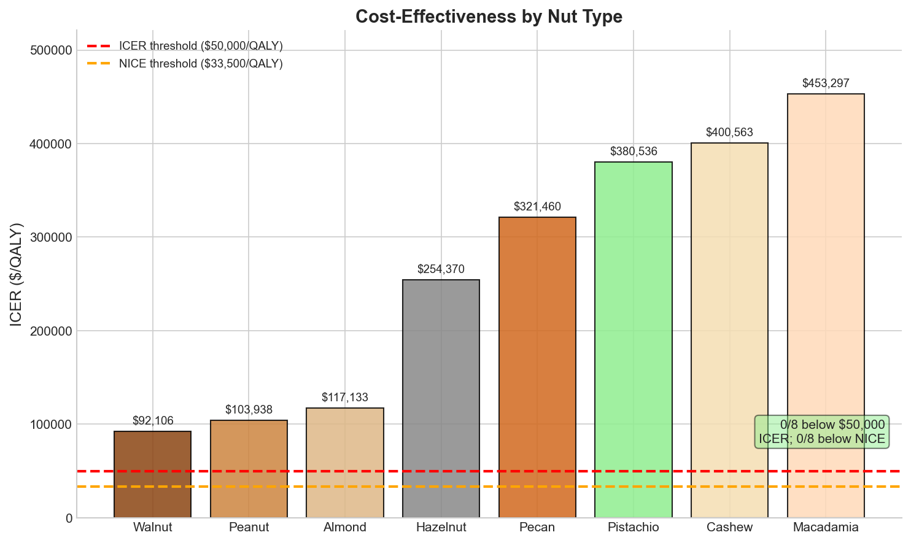

```{python}
#| echo: false
#| output: false
from whatnut.results import r
```

## Abstract

**Objectives.** Observational studies associate daily nut consumption with 15–25% reductions in all-cause mortality, but those associations are vulnerable to healthy-user bias and over-translation from intermediate biomarkers to hard outcomes. I estimate the plausible lifetime health and cost-effectiveness of sustained daily nut consumption under explicitly skeptical prior assumptions, from a consumer perspective.

**Methods.** I built a hierarchical Monte Carlo evidence-synthesis model with nutrient-derived log-RR priors, tiered publication-bias shrinkage on nut-specific RCT residuals, a Beta(`{python} r.confounding_alpha`, `{python} r.confounding_beta`) causal-fraction prior (mean `{python} r.confounding_mean`), and lifecycle integration over CDC 2021 US life tables and EQ-5D quality weights. Eight nuts were analyzed (walnut, almond, pistachio, pecan, macadamia, peanut, hazelnut, cashew). `{python} f"{r.n_samples:,}"` Monte Carlo draws at seed `{python} r.seed`.

**Results.** For a `{python} r.target_age`-year-old US resident with `{python} f"{r.baseline_life_years:.0f}"` remaining life years, the base case estimates `{python} r.life_years_range` additional life years (`{python} r.months_range` months) — walnuts (`{python} r.walnut.life_years_fmt` yr, P(>0)=`{python} f"{int(round(r.walnut.p_positive * 100))}"`%) rank highest; cashews (`{python} r.cashew.life_years_fmt` yr) lowest. Approximately `{python} r.cvd_contribution`% of modeled benefit operates through cardiovascular disease prevention. From a consumer perspective using 2026 US retail prices, incremental cost-effectiveness ratios range from `{python} r.icer_range` per QALY across the eight nuts, with walnut (`{python} r.walnut.icer_fmt`/QALY) and peanut (`{python} r.peanut.icer_fmt`/QALY) most cost-effective.

**Alternative analyses.** Under a more permissive confounding prior (mean 33%) walnut life-year gains approximately double; under very skeptical confounding (mean 10%) they halve (Table 7). Removing the ALA CVD prior (the single most influential nutrient input) reduces walnut rankings by ~50%.

**Conclusions.** Once confounding and pathway optimism are shrunk aggressively, nuts look like a modest dietary lever rather than a major longevity intervention. The main contribution is methodological: a transparent, skeptical evidence-synthesis framework with an end-to-end audit trail from raw USDA / CDC / retail data through to the reported ICERs. Individual ICERs are sensitive to price channel (specialty vs bulk ~3×) and discounting choice.

## Introduction

### The nut-mortality association

@fraser1992possible first linked nut consumption to reduced coronary heart disease risk in the Adventist Health Study over three decades ago. Subsequent prospective cohorts replicated this finding: @ellsworth2001frequent in the Iowa Women's Health Study, @albert2002nut in the Physicians' Health Study, and @hu1998nhs in the Nurses' Health Study each found 30-50% reductions in cardiovascular disease (CVD) risk among regular nut consumers.

Three large-scale analyses expanded the cohort evidence base. @bao2013association analyzed 118,962 participants from the Nurses' Health Study and Health Professionals Follow-up Study, finding that consuming nuts ≥7 times per week reduced all-cause mortality by 20% (hazard ratio [HR] 0.80, 95% CI: 0.73-0.86). @grosso2015nut meta-analyzed 354,933 participants across 7 cohort studies retained for the all-cause mortality pooled analysis, estimating a 19% reduction (relative risk [RR] 0.81, 95% CI: 0.77-0.85) for highest versus lowest consumption. @aune2016nut synthesized 819,448 participants across 20 cohort studies, finding that 28g/day of nut consumption reduced all-cause mortality by 22% (RR 0.78, 95% CI: 0.72-0.84). @vandenbrandt2015nut extended the cohort evidence into the Netherlands Cohort Study (n=120,852), and @suprono2025ahs2 reports the most recent Adventist Health Study-2 follow-up with IHD-specific endpoints. Change-in-consumption analyses in NHS/HPFS/NHSII [@liu2020changes] suggest that increasing nut intake over time is associated with reduced CVD incidence. Non-Western cohorts including @shin2024korea (20-year Korean follow-up) broaden external validity beyond the US/European evidence base. A 2026 dose-response update by @liu2025nut (epub September 2025), encompassing 63 prospective cohort studies, confirmed these findings with an all-cause mortality RR of 0.77 (95% CI: 0.73-0.81) and CVD mortality RR of 0.74 (0.70-0.78), while identifying a nonlinear dose-response with benefits plateauing around 15-20 g/day. @liu2021walnut estimated walnut-specific life expectancy gains of approximately 1.3 years at age 60 in the Nurses' Health Study and Health Professionals Follow-up Study.

### Cause-specific effects

The mortality benefit appears concentrated in cardiovascular causes. @aune2016nut find stronger associations for coronary heart disease mortality (RR 0.71, 95% CI: 0.63-0.80) than cancer mortality (RR 0.87, 95% CI: 0.80-0.93). CVD mortality more broadly showed RR 0.79 (0.70-0.88). This pattern aligns with mechanistic studies showing that nuts improve intermediate CVD risk factors: @delgobbo2015effects meta-analyzed 61 controlled feeding trials (n=2,582) and found that nut consumption reduces low-density lipoprotein (LDL) cholesterol by 4.8 mg/dL (0.12 mmol/L), with additional improvements in apolipoprotein B and triglycerides. An updated meta-analysis of 113 RCTs by @nishi2025lipid confirmed nut consumption lowers LDL cholesterol by 0.12 mmol/L (4.6 mg/dL), consistent with the earlier findings.

### The confounding problem

Distinguishing causal effects from confounding remains the primary challenge in nutritional epidemiology. Nut consumers differ from non-consumers across multiple dimensions: the NHS + HPFS cohort analysis by @bao2013association reports (Table 1) that frequent consumers have higher physical activity, lower smoking rates, higher educational attainment, and healthier overall diets than non-consumers. While cohort studies adjust for these measured confounders, unmeasured confounding may persist.

Three lines of evidence inform the causal fraction of observed associations. First, @hashemian2017nut studied 50,045 adults in the Golestan cohort in northeastern Iran, where nut consumption does not correlate with Western healthy lifestyle patterns. The mortality association persisted (HR 0.71 for ≥3 servings/week), suggesting causal effects independent of healthy-user confounding. Second, sibling-comparison designs that control for shared genetic and environmental factors typically find attenuated—though non-zero—dietary associations. Third, calibrating observed effects against the magnitude predicted from RCT-demonstrated improvements in intermediate outcomes (e.g., LDL cholesterol) suggests that only a fraction of observed associations can be mechanistically explained. A two-step Mendelian randomization study by @wang2025mr found largely null genetic associations between overall nut consumption and CVD outcomes but an unexpected *positive* inverse-variance-weighted association between genetically predicted processed-peanut exposure and ischemic heart disease — a signal the authors note is sensitive to instrument selection and may reflect processed-food confounders rather than a causal harm of peanuts. Mendelian randomization has well-known power limitations for dietary exposures due to weak genetic instruments, so neither the null tree-nut finding nor the positive processed-peanut finding is dispositive.

### Gaps in existing literature

Three limitations motivate this analysis. First, most studies examine "any nuts" as a single category, obscuring compositional differences. Walnuts contain 2.5g of alpha-linolenic acid (ALA) omega-3 per 28g serving; almonds contain essentially none. Macadamias contain 3.6g of palmitoleic acid (omega-7, SR-Legacy 16:1 undifferentiated); other nuts contain negligible amounts. These differences may translate to differential health effects.

Second, relative risk reductions do not directly map to absolute benefits. A 22% mortality reduction translates to different absolute life expectancy gains depending on baseline mortality risk, age distribution of benefits, and cause-specific mortality patterns.

Third, no existing study quantifies absolute life expectancy gains from nut consumption. While @fadnes2022estimating and its UK update @fadnes2023uk modeled life expectancy gains from dietary changes broadly, no study has provided nut-specific estimates with uncertainty quantification. Health policy requires standardized metrics for resource allocation; quality-adjusted life years (QALYs) enable comparison across interventions. The UK National Institute for Health and Care Excellence (@nice2025threshold), US Institute for Clinical and Economic Review (@icer2024reference), and WHO-CHOICE (World Health Organization CHOosing Interventions that are Cost-Effective) use QALYs in cost-effectiveness analyses.

### Contribution

This paper develops a skeptical Monte Carlo evidence-synthesis framework for estimating life expectancy gains from nut consumption, addressing: (1) expected benefit magnitude in absolute terms (life years); (2) nut type comparisons based on compositional differences; and (3) explicit treatment of confounding, pathway credibility, and lifecycle translation. QALYs are computed for cost comparison, but the primary aim is to construct a transparent benchmark rather than make strong causal claims from cohort data alone. Throughout this paper, "nuts" refers to tree nuts plus peanuts (a legume), following epidemiological convention.

### A note on metrics

This paper reports **life years gained** (`{python} r.life_years_range` years, or `{python} r.months_range` months) as the primary metric. Under the skeptical base case, the relevant scale is generally weeks to a few months, not years.

For cost comparison, I also report **QALYs** (quality-adjusted life years), which weight life years by age-specific EuroQol 5-Dimension (EQ-5D) norms. Following the newer Optiqal stance, health gains are not discounted (0%), while costs are discounted at 3% to reflect time preference for spending rather than a lower intrinsic value of future health [@claxton2011differential; @gravelle2001differential]. This diverges from the US 2nd Panel reference case (3% for both [@sanders2016second]) but is increasingly supported in CEA methodology debates, particularly when gains accrue far in the future and discounting them obscures the magnitude of long-horizon benefits. Note that this analysis models only **mortality effects**. Potential morbidity benefits or harms from substitution patterns are not quantified directly, so these QALY estimates are incomplete welfare measures rather than full utility calculations.

## Methods

### Evidence sources

I constructed a hierarchical evidence base drawing on four categories of sources, in order of priority. Meta-analyses of mortality outcomes from @aune2016nut and @grosso2015nut provide pooled estimates for all-cause mortality. Large prospective cohort studies, including @bao2013association and @guasch2017nut, provide nut-specific associations. Randomized controlled trials—PREDIMED (@ros2008mediterranean 2008 biomarker pilot; @estruch2018primary primary CVD-endpoint trial), Walnuts and Healthy Aging (@rajaram2021walnuts), the lipid meta-analysis by @delgobbo2015effects, and nut-specific RCTs by @hart2025pecan, @guarneiri2021pecan, @mah2017cashew, and @orem2013hazelnut—inform nut-specific adjustment factors. Nutrient composition data from @usda2024fooddata provides standardized nutrient profiles.

### Nut nutrient profiles

Nuts vary in macronutrient and micronutrient composition [@usda2024fooddata]. All contain 12-22g fat per 28g serving, but differ in fatty acid profiles (monounsaturated vs. polyunsaturated), micronutrient content, and caloric density (155-201 kcal per serving).

**Table 1: Nut nutrient profiles.** Macronutrients and selected micronutrients per 28g serving. ALA = alpha-linolenic acid (plant-based omega-3 fatty acid); MUFA = monounsaturated fatty acids; PUFA = polyunsaturated fatty acids. Values from USDA FoodData Central SR Legacy database, accessed December 2024.

| Nut | FDC ID | kcal | Fat (g) | MUFA | PUFA | ALA (g) | Fiber (g) | Protein (g) | Notable |
|-----|--------|------|---------|------|------|---------|-----------|-------------|---------|
| Walnut | [170187](https://fdc.nal.usda.gov/fdc-app.html#/food-details/170187/nutrients) | 183 | 18.3 | 2.5 | 13.2 | 2.5 | 1.9 | 4.3 | Highest omega-3 |
| Almond | [170567](https://fdc.nal.usda.gov/fdc-app.html#/food-details/170567/nutrients) | 162 | 14.0 | 8.8 | 3.4 | 0.0 | 3.5 | 5.9 | Highest vitamin E (7.2mg) |
| Pistachio | [170184](https://fdc.nal.usda.gov/fdc-app.html#/food-details/170184/nutrients) | 157 | 12.7 | 6.5 | 4.0 | 0.1 | 3.0 | 5.7 | Lutein (342μg) |
| Pecan | [170182](https://fdc.nal.usda.gov/fdc-app.html#/food-details/170182/nutrients) | 193 | 20.2 | 11.4 | 6.0 | 0.3 | 2.7 | 2.6 | High MUFA |
| Macadamia | [170178](https://fdc.nal.usda.gov/fdc-app.html#/food-details/170178/nutrients) | 201 | 21.2 | 16.5 | 0.4 | 0.1 | 2.4 | 2.2 | Omega-7 (3.6g) |
| Peanut | [172430](https://fdc.nal.usda.gov/fdc-app.html#/food-details/172430/nutrients) | 159 | 13.8 | 6.8 | 4.4 | 0.0 | 2.4 | 7.2 | Highest protein |
| Hazelnut | [170581](https://fdc.nal.usda.gov/fdc-app.html#/food-details/170581/nutrients) | 176 | 17.0 | 12.8 | 2.2 | 0.0 | 2.7 | 4.2 | PREDIMED arm; high MUFA + vit E (4.2mg) |
| Cashew | [170162](https://fdc.nal.usda.gov/fdc-app.html#/food-details/170162/nutrients) | 155 | 12.3 | 6.7 | 2.2 | 0.0 | 0.9 | 5.1 | Lowest fat/fiber |

Walnuts have the highest ALA omega-3 content (2.5 g/28 g), comprising 72% of total fat as polyunsaturated fatty acids. ALA is a precursor to eicosapentaenoic acid (EPA) and docosahexaenoic acid (DHA) [@ros2008mediterranean]. Almonds have the highest vitamin E content (7.2 mg/28 g, ~48% DV) and highest fiber content among tree nuts (3.5 g/28 g). Macadamias are the only common nut with substantial omega-7 fatty acids (palmitoleic acid, 3.6 g/28 g); they also have the highest caloric density (201 kcal) and saturated fat content (3.4 g). Peanuts (technically legumes) have the highest protein content (7.2 g/28 g) and lowest cost; aflatoxin contamination occurs in some regions, particularly sub-Saharan Africa and Southeast Asia [@williams2004aflatoxin].

**Note on Brazil nuts**: Brazil nuts are excluded from this analysis. Brazil-nut selenium content is highly soil-dependent, but a standard 28 g serving typically exceeds the 400 μg/day tolerable upper intake level for selenium established by the Institute of Medicine [@iom2000selenium], precluding inclusion in a daily-consumption model.

### Statistical model

I implemented a Monte Carlo uncertainty propagation model with hierarchical structure and standardized prior draws (the `τ · z` reparameterization keeps the hierarchical scale numerically well-behaved). The model samples from nutrient-derived priors (no likelihood function or outcome data) and propagates uncertainty through a lifecycle model to estimate life expectancy gains. Because there is no likelihood, the "non-centered parameterization" label sometimes attached to this structure in Bayesian hierarchical inference does not add anything here — it is purely a numpy-level convenience for sampling `θ_nut = θ_nutrients + τ · z`.

![**Figure 1: Model architecture.** The model transforms nut composition into life expectancy estimates through four stages: (1) **Nutrients** from USDA data define each nut's profile; (2) **Pathway effects** translate nutrients into CVD, cancer, and other mortality reductions using meta-analysis priors; (3) **Confounding adjustment** accounts for observational study limitations; (4) **Lifecycle integration** converts relative risks to absolute life years using CDC mortality tables. Technical details (non-centered parameterization, Monte Carlo uncertainty propagation) are described in the Methods text.](_static/figures/model_architecture.png){#fig-architecture width="100%"}

**Note on model structure**: This is an **evidence synthesis model** that propagates uncertainty from multiple prior sources (nutrient effect estimates, nut-specific RCT residuals, confounding calibration) through to life expectancy estimates. Unlike traditional Bayesian analyses that update beliefs from outcome data via a likelihood function, this model synthesizes prior information without a likelihood linking to mortality observations. The output distributions represent **propagated prior uncertainty** — the range of plausible life expectancy gains given current evidence — not posterior distributions from data-driven updating. This approach is appropriate because the goal is uncertainty quantification from existing evidence synthesis, not parameter estimation from a novel dataset. Throughout this paper, I use "uncertainty interval" rather than "posterior" to avoid implying data-driven updating where none occurs.

#### Pathway-specific effects

The model estimates separate relative risks for three mortality pathways. CVD mortality shows the largest effects (RR `{python} r.cvd_effect_range`), informed by ALA omega-3, fiber, and magnesium priors. Cancer mortality sits close to null (RR `{python} r.cancer_effect_range`) after strong shrinkage of the weak per-nutrient cancer priors. Other mortality (RR `{python} r.other_effect_range`) is of comparable magnitude to cancer and represents a composite of remaining causes. This decomposition allows different nutrients to contribute differentially to each pathway — for example, ALA omega-3 strongly affects CVD but has negligible cancer effects, while fiber contributes to both.

I do not model a separate morbidity pathway. While nuts may improve quality of life through reduced non-fatal CVD events, improved cognitive function, and other morbidity effects, this analysis focuses solely on mortality. QALYs are computed by weighting mortality-based life expectancy gains by population EQ-5D norms (age-specific quality weights), not by modeling nut-specific quality improvements. Excluding morbidity benefits means these estimates are lower bounds—actual benefits may be larger if nuts reduce morbidity beyond their mortality effects.

#### Nutrient-derived priors

Rather than specifying nut-specific effects directly, I derived expected effects from nutrient composition using priors from independent meta-analyses:

**Table 2: Nutrient-pathway effect priors.** Log-relative risk per unit nutrient, with pathway-specific coefficients. Priors from meta-analyses of prospective cohort studies and randomized trials. For nutrients with limited direct evidence, I use wide priors (SD ≥50% of mean) reflecting mechanistic plausibility with high uncertainty.

| Nutrient | CVD Effect | Cancer Effect | Other Effect | Source |
|----------|------------|---------------|--------------|--------|
| ALA omega-3 (per g) | -0.05 (0.03) | 0.00 (0.015) | -0.008 (0.02) | @naghshi2021ala |
| Fiber (per g) | -0.015 (0.005) | -0.004 (0.003) | -0.004 (0.003) | @threapleton2013fiber |
| Omega-6 (per g) | -0.003 (0.003) | 0.00 (0.003) | 0.00 (0.002) | @farvid2014omega6 |
| Omega-7 (per g) | -0.01 (0.03) | 0.00 (0.01) | -0.003 (0.01) | Mechanistic (wide prior) |
| Saturated fat (per g) | +0.025 (0.01) | +0.002 (0.005) | +0.004 (0.005) | @sacks2017sat |
| Magnesium (per mg)† | -0.001 (0.0004) | 0.00 (0.0001) | -0.00005 (0.00005) | @fang2016mg |
| Arginine (per 100mg) | -0.001 (0.0015) | 0.00 (0.0005) | 0.00 (0.001) | Mechanistic (wide prior) |
| Vitamin E (per mg) | 0.00 (0.005) | 0.00 (0.005) | 0.00 (0.003) | Food-based, centered at zero |
| Phytosterols (per mg)† | -0.00005 (0.0001) | 0.00 (0.00002) | 0.00 (0.00002) | Mechanistic (wide prior) |
| Protein (per g) | 0.00 (0.005) | 0.00 (0.002) | 0.00 (0.003) | Mechanistic (wide prior) |

†Magnesium and phytosterol priors are specified per mg. Magnesium derived from Fang 2016 (RR 0.90 per 100mg, ln(0.90)/100 = -0.00105/mg); phytosterol derived from LDL-lowering mechanism (-0.001 per 10mg = -0.0001 per mg).

††Vitamin E: RCTs of high-dose supplements (SELECT, HOPE-TOO) found null or harmful effects, but these tested pharmacological doses (400-800 IU/day) far exceeding food-based intake. The vitamin E prior reflects food-matrix effects at nutritional doses (7mg from almonds vs 400mg from supplements), with wide uncertainty (SD = 100% of mean for cancer) to account for conflicting evidence. Dropping vitamin E from the model changes walnut QALYs by <2%.

{#fig-nutrients width="90%"}

#### Hierarchical structure

I model nut-specific effects as standardized deviations from nutrient-predicted effects. Let $z_{\text{pathway}} \sim \mathcal{N}(0, 1)$ represent the standardized deviations and $\tau_{\text{pathway}} \sim \text{HalfNormal}(0.015)$ represent the shrinkage scale. Relative to earlier versions, this smaller $\tau$ reflects a stronger prior that most between-nut differences should already be explained by nutrient composition, with only modest residual bonuses from nut-specific RCT evidence. The true effect for each nut-pathway combination is then $\theta_{\text{true}} = \theta_{\text{nutrients}} + \tau_{\text{pathway}} \cdot z_{\text{pathway}}$.

Prior predictive checks confirm these priors generate small, mostly CVD-centered mortality effects rather than large all-cause gains. That is deliberate: the model is meant to be skeptical about translating nutrition biomarkers into long-run survival.

#### HR-centered aggregation

Each per-unit nutrient prior is drawn as $\beta_{nj} \sim \mathcal{N}(\mu_{nj}, \sigma_{nj})$ on the log-RR scale, and per-unit means $\mu_{nj}$ are taken from meta-analysis point estimates. The pre-adjustment aggregate log-RR inherits variance $\sum_n \sigma_{nj}^2 x_{nj}^2 + \tau^2$, so naive exponentiation would over-state $E[RR]$ by half that variance (Jensen's inequality). Mirroring the hr-centered lognormal parameterization used in the newer Optiqal framework, the model subtracts this variance/2 from each sample so that the *pre-adjustment* expected RR equals $\exp(\sum_n \mu_{nj} x_{nj})$. A small residual Jensen gap remains after the nut-specific adjustment multiplication and is documented in the appendix; its effect is under 0.15 percentage points on RR at current prior SDs (worst case walnut CVD, where both terms of the gap are largest).

#### Tiered publication-bias shrinkage

Nut-specific pathway adjustments (walnut's CVD residual beyond its nutrient profile, etc.) have their central estimate shrunk toward the null (a = 1) by a tier-dependent factor that mirrors the evidence-quality shrinkage in the newer Optiqal framework. Strong-evidence nuts retain 85% of the nominal nut-specific edge, moderate-evidence 70%, and limited-evidence 50%. Following optiqal's convention, only the central estimate is attenuated; the adjustment SD is preserved so that uncertainty still reflects replication risk rather than the attenuation factor itself. The nutrient priors themselves are already drawn from meta-analyses and are assumed pre-shrunk; this layer addresses the residual pub-bias risk specific to nut-only RCTs and single-cohort walnut or pistachio stories that have not replicated broadly.

#### Confounding adjustment

The model includes a causal fraction parameter with Beta(`{python} r.confounding_alpha`, `{python} r.confounding_beta`) prior (mean `{python} r.confounding_mean`, 95% interval: `{python} f"{r.confounding_ci_lower:.2f}-{r.confounding_ci_upper:.2f}"`), calibrated to three evidence sources (see Confounding Calibration section below).

#### Lifecycle integration

I propagate Monte Carlo samples of pathway-specific relative risks through a lifecycle model using CDC life tables for age-specific mortality (NVSR Vol 72 No 12), age-varying cause-of-death fractions derived from Table 6 of @xu2024deaths (2021 US total population), and age-specific quality weights smoothed from EQ-5D population norms in @sullivan2006catalogue (~0.89 at age 40, declining with age). Under the NVSR-based cause fractions, the combined heart-disease plus cerebrovascular share of all-cause mortality rises from ~15% at age 40 to ~29% at age 80 (see appendix); this is ~3–5 pp narrower than the broader ICD-10 I00–I99 aggregate used in CDC WONDER. Health gains are undiscounted in the base case, while costs are discounted at 3% and survival-weighted using the intervention survival curve.

{#fig-cause-fractions width="85%"}

### Confounding calibration

The source meta-analyses adjusted for measured confounders (age, sex, body mass index [BMI], smoking, alcohol, physical activity). This section addresses what fraction of the *residual* association—after these adjustments—reflects causal effects versus unmeasured confounding.

**LDL pathway**: @delgobbo2015effects find that nuts reduce LDL cholesterol by 4.8 mg/dL (0.12 mmol/L) per serving in 61 RCTs. Applying the Cholesterol Treatment Trialists' per-1-mmol/L dose-response of ~22% reduction in major CHD events [@ctt2010intensive], this predicts ~2.7% CVD event reduction — compared to ~25% observed in cohorts. However, this 12% "mechanism explanation" represents only one of several causal pathways. Nuts also reduce blood pressure (~1-3 mmHg), improve glycemic control, provide anti-inflammatory omega-3 fatty acids, and deliver antioxidants and fiber [@ros2008mediterranean]. The LDL pathway therefore provides a *floor* on the causal fraction, not a ceiling.

**Sibling comparison evidence**: Within-family designs control for shared genetic and environmental confounding [@frisell2012sibling]. If sibling-controlled estimates are 30-50% smaller than unpaired estimates, this implies 50-70% of the association survives sibling control—suggesting a causal fraction in that range for dietary factors generally. However, no sibling studies exist specifically for nut consumption, and sibling designs may over-adjust by removing non-confounding shared factors.

**Golestan cohort**: @hashemian2017nut studied nut consumption in Iran, where nut consumers were *more* likely to smoke and be obese (the opposite of Western cohorts). Their adjusted HR of 0.71 represents a *larger effect magnitude* (29% mortality reduction) than @aune2016nut's Western estimate of 0.78 (22% reduction). This pattern is consistent with a causal effect and suggests healthy-user confounding in Western cohorts does not grossly inflate observed associations. However, alternative explanations exist: the larger effect in Golestan may reflect (1) higher baseline CVD risk in that population (where relative effects are expected to be larger), (2) compositional differences in nut types consumed (more pistachios and walnuts in Iran), or (3) different residual confounding structures. The Golestan evidence supports a causal fraction of at least 50-100% of the adjusted Western effect, but does not precisely quantify it.

**E-value analysis**: Using VanderWeele's method [@vanderweele2017sensitivity], the E-value for HR=0.78 is `{python} r.e_value`. An unmeasured confounder would need associations of at least RR = `{python} r.e_value` — on the risk-ratio scale, with both nut consumption and mortality — to fully explain the observed effect. For context: exercise-mortality RR ≈ 1.5-2.0; income-mortality RR ≈ 1.3-1.5. An E-value of `{python} r.e_value` suggests moderate residual confounding is plausible but unlikely to explain the entire association.

**Prior specification**: Synthesizing this evidence, I adopt a Beta(`{python} r.confounding_alpha`, `{python} r.confounding_beta`) prior with mean `{python} r.confounding_mean` and 95% CI: `{python} f"{int(round(r.confounding_ci_lower * 100))}-{int(round(r.confounding_ci_upper * 100))}"`%. This is intentionally skeptical rather than agnostic. The LDL floor, largely null Mendelian-randomization evidence for tree-nut exposures (with an anomalous positive processed-peanut/IHD signal that the authors themselves treat as driven by processing rather than peanuts), and the broader history of healthy-user bias in nutrition all argue against treating much of the cohort association as causal by default. Golestan and substitution evidence keep the prior from collapsing fully to zero, but the base case no longer assumes anything close to a 50% causal carry-through.

{#fig-confounding width="90%"}

### Target population

The reference case is a **`{python} r.target_age`-year-old US resident, sex- and race-aggregated**, with `{python} f"{r.baseline_life_years:.0f}"` remaining life years based on 2021 CDC life tables. Baseline health status is population-average: the model does not stratify by body-mass index, blood-pressure category, cholesterol profile, diabetes status, smoking status, or socioeconomic position. Mortality and cost-of-death fractions are US-specific; European generalizability requires substituting ONS or Eurostat life tables and is not attempted here. Individuals with tree-nut or peanut allergies are excluded a priori (`{python} r.allergy_prevalence_lower`–`{python} r.allergy_prevalence_upper`% combined prevalence in US adults [@gupta2019adultallergy]); results should not be read as applying to pediatric populations, pregnant/lactating adults, or individuals with existing cardiovascular disease.

### Cost-effectiveness analysis

**Perspective.** The analysis adopts a **consumer perspective**: costs are the out-of-pocket retail price a US consumer pays for raw shelled nuts. Healthcare costs (e.g., averted CVD-event costs, residual cancer treatment, disability costs), productivity losses, and household time costs are not included. A payer or societal perspective would add these, typically reducing ICERs (because averted CVD event costs offset food costs); the consumer perspective is the most conservative framing for the "should I eat more nuts?" question this paper asks.

**Outcomes included.** The outcome panel is limited to all-cause mortality reductions translated into life years and age-weighted QALYs. **Morbidity benefits** (non-fatal CVD events, cognitive function, glycemic control) and **harms beyond allergy** (calorie-surplus weight gain, heavy-metal exposure, aflatoxin in non-US-regulated supply chains) are acknowledged in the Limitations section but excluded from the model — both because they require outcome data this analysis does not carry and because including one-sided morbidity benefits without one-sided harms would bias the headline number upward.

**QALY derivation.** Life years gained are weighted by age-specific health-related quality-of-life weights derived from Sullivan & Ghushchyan (2006) US EQ-5D population norms [@sullivan2006catalogue]. The smoothed trajectory (~0.89 at age 40, declining with age; see `data/quality_weights.yaml`) is applied to the intervention minus baseline survival curve.

**ICER and incremental costs.** I calculated incremental cost-effectiveness ratios (ICERs) as the ratio of **survival-weighted discounted lifetime costs** (USD, 2026 price year, discounted at 3%) to **undiscounted lifetime QALYs gained**. Costs are retrieved in 2026 US dollars and not inflated or deflated to a reference year; at the 3% annual discount rate applied to the intervention survival curve, lifetime discounted cost per person at age 40 ranges from ~\$`{python} f"{r.peanut.annual_cost * 22:.0f}"` for peanuts to ~\$`{python} f"{r.macadamia.annual_cost * 22:.0f}"` for macadamias (approximate; exact per-nut values are propagated through `results.json`). Per-year nut retail costs from nuts.com (2026-04-19): peanuts (\$`{python} f"{r.peanut.annual_cost:.0f}"`/year), almonds (\$`{python} f"{r.almond.annual_cost:.0f}"`/year), walnuts (\$`{python} f"{r.walnut.annual_cost:.0f}"`/year), cashews (\$`{python} f"{r.cashew.annual_cost:.0f}"`/year), pistachios (\$`{python} f"{r.pistachio.annual_cost:.0f}"`/year), pecans (\$`{python} f"{r.pecan.annual_cost:.0f}"`/year), hazelnuts (\$`{python} f"{r.hazelnut.annual_cost:.0f}"`/year), and macadamias (\$`{python} f"{r.macadamia.annual_cost:.0f}"`/year) [@whatnut2026prices]. The raw retrieval is committed at `src/whatnut/data/raw/retail_prices/retail_prices.csv` with per-row retailer, product URL, package size, and price. Big-box bulk pricing runs roughly 2–3× lower than specialty retail, which would shift ICERs proportionally (see Limitations).

## Results

### Consistency validation

As a consistency check, I verified that the model's implied all-cause mortality effects are materially smaller than the source cohort associations. That attenuation is intentional. The model is designed to translate observational signals through skeptical pathway and confounding filters, not to reproduce the raw RR of 0.78 from the cohort meta-analysis.

### Predictive checks

I verified that individual Monte Carlo draws produce scientifically plausible outcomes. All `{python} r.n_samples` samples yield pathway-specific RRs within a plausible range, with no draws producing implausible values (RR > 1.5 or RR < 0.5). All sampled QALYs fall within plausible ranges consistent with the maximum possible benefit given remaining life expectancy; negative values (reflecting uncertainty about harm) occur in a small fraction of draws. CVD, cancer, and other mortality contributions sum to approximately 100% across all draws, confirming the decomposition is internally consistent. These checks confirm the model produces valid predictions across the full sampled distribution, not just at the mean.

### Primary finding

The model estimates that a `{python} r.target_age`-year-old consuming 28g/day of nuts over their remaining lifespan gains `{python} r.life_years_range` additional life years (`{python} r.months_range` months), with walnuts (`{python} r.walnut.life_years_fmt` years) ranking highest and cashews (`{python} r.cashew.life_years_fmt` years) lowest. Under the skeptical base case, these are modest absolute effects rather than transformative gains. Approximately `{python} r.cvd_contribution`% of modeled benefit operates through CVD mortality prevention.

{#fig-forest width="90%"}

**Table 3: Life year and QALY estimates by nut type.** Monte Carlo estimates (`{python} r.n_samples` samples, seed=`{python} r.seed`). Life years (LY) are the primary metric. QALYs weight life years by age-specific quality of life using 0% health discounting. `P(>0)` and `P(<0)` summarize the direction of expected net benefit under the sampled prior draws.

```{python}
#| echo: false
from IPython.display import HTML
HTML(r.table_3_qalys())
```

Note: "Undefined" indicates the ICER upper interval is not reported when the lower QALY-CI bound is ≤ 0 (the denominator straddles zero benefit). This is a terminological distinction from CEA "dominance", which reserves "dominated" for alternatives beaten on both cost and effect. Evidence quality: Strong = multiple RCTs or large cohorts (n>100,000); Moderate = single RCT or smaller cohorts; Limited = RCTs with confidence intervals crossing null.

### Scenario notes

Absolute gains are sensitive to initiation age and persistence. Starting later in life leaves less time for small annual risk reductions to accumulate, while imperfect long-run adherence lowers both expected benefit and expected lifetime cost roughly proportionally. The base case should therefore be interpreted as a policy-style benchmark for sustained nut consumption, not a guarantee about what happens if a person buys one more bag of walnuts.

Dose-response also matters. The cohort literature suggests benefits plateau around 15-20 g/day, so the 28 g/day serving size used here should not be interpreted as linearly superior to smaller daily servings. That plateau is one reason the model now shrinks aggressively rather than extrapolating a full ounce into near-year-scale life gains.

### Pathway-specific relative risks

CVD mortality reductions are substantially larger than cancer or other-cause effects, which explains why walnuts rank highest among the nuts analyzed.

**Table 4: Pathway-specific relative risks by nut type.** Mean RRs for each mortality pathway. Lower values indicate greater benefit.

```{python}
#| echo: false
from IPython.display import HTML
HTML(r.table_4_pathway_rrs())
```

{#fig-pathway-rrs width="90%"}

### Pathway contributions

Approximately `{python} r.cvd_contribution`% of the QALY benefit operates through CVD prevention, with the remainder split between other mortality (`{python} r.other_contribution`%) and cancer mortality (`{python} r.cancer_contribution`%).

This is a major change from earlier, more optimistic versions of the model, which allowed weakly evidenced "other" pathways to contribute much more. The direct evidence for nuts improving LDL and other cardiometabolic markers is much stronger than the evidence for broad respiratory, infectious, neurodegenerative, or cancer mortality effects. In the current model, those weaker pathways are still allowed to contribute, but only after strong shrinkage toward zero.

**Table 5: Pathway contribution to total benefit.** Decomposition of QALY gains by mortality pathway. CVD dominates due to both stronger relative risk reductions and higher cause-specific mortality at older ages.

| Pathway | Contribution | Mean RR Range | Key Nutrients |
|---------|-------------|---------------|---------------|
| CVD mortality | ~`{python} r.cvd_contribution`% | `{python} r.cvd_effect_range` | ALA omega-3, fiber, magnesium |
| Other mortality | ~`{python} r.other_contribution`% | `{python} r.other_effect_range` | Fiber, magnesium |
| Cancer mortality | ~`{python} r.cancer_contribution`% | `{python} r.cancer_effect_range` | Fiber |

### Cost-effectiveness

ICERs range from `{python} r.icer_range`/QALY under the current specification. Because the absolute benefits are modest, cost differences matter a lot. Peanuts remain cheapest but only moderately effective, while walnuts look stronger on benefit but carry higher annual cost. Macadamias, pecans, and cashews look weak on value because their modeled benefits are small and uncertain relative to price.

These ICERs should be treated as secondary outputs. They depend on the chosen cost discount rate, the assumption of sustained intake, and the unresolved question of what food nuts replace in practice.

{#fig-icer width="90%"}

### Uncertainty quantification

Uncertainty interval width reflects nutrient prior precision, evidence quality, and hierarchical shrinkage. Walnuts have relatively narrower intervals because ALA's CVD effect is better characterized than the distinctive claims made for omega-7-rich macadamias or more weakly studied nuts such as cashews and pecans. The new `P(<0)` output in Table 3 is useful here: it makes clear that some nuts still have a non-trivial chance of being net harmful or simply useless under the skeptical prior draws.

## Discussion

### Key findings

The model estimates `{python} r.life_years_range` additional life years (`{python} r.months_range` months) from sustained daily nut consumption, with walnuts ranking highest (`{python} r.walnut.life_years_fmt` years) and cashews lowest (`{python} r.cashew.life_years_fmt` years). Those gains are now on the scale of weeks to a few months rather than nearly a year.

The CVD pathway accounts for approximately `{python} r.cvd_contribution`% of modeled benefit, with other mortality contributing `{python} r.other_contribution`% and cancer `{python} r.cancer_contribution`%. That concentration in CVD is more plausible than earlier versions, because the strongest causal evidence for nuts still runs through lipid and cardiometabolic markers rather than broad anti-cancer or anti-aging claims.

### Comparison to prior estimates

These estimates are much lower than unadjusted observational interpretations. @liu2021walnut estimated 1.3 additional life years for walnut consumers at age 60, while @fadnes2022estimating modeled around 2 years gained from sustained nut consumption starting at age 20. The current paper lands far below those values because the base case now uses a skeptical confounding prior, smaller nut-specific residual adjustments, and much stronger shrinkage on cancer and other-cause pathways.

I view that downward revision as a feature, not a bug. Nuts are plausible as a modest causal intervention, but the evidence does not support treating them like a statin-equivalent longevity tool.

### Sensitivity analyses

The model has no likelihood function linking directly to outcome data, so sensitivity analysis is central rather than optional. Table 7 shows how the headline QALY outputs move under alternative confounding assumptions:

**Table 7: Sensitivity to confounding prior.** QALY estimates under alternative confounding assumptions.

```{python}
#| echo: false
from IPython.display import HTML
HTML(r.table_7_sensitivity())
```

Shrinking the nut-specific residual scale matters too. The baseline model uses $\tau \sim \text{HalfNormal}(0.015)$, which keeps nut-specific bonuses modest after nutrient composition is already accounted for. This prevents the paper from assigning large residual advantages to walnuts, pistachios, or macadamias on thin evidence.

### Substitution effects

The model still treats nut consumption as an intervention layered onto a baseline diet, but the real-world effect depends on what nuts replace. Replacing refined carbohydrates or processed snacks is more plausible as a net-positive move than replacing other healthy fats or simply adding 160-200 kcal/day on top of an already adequate diet. Replacing red meat would likely sit between those extremes.

@li2015substitution modeled isocaloric substitution in the Nurses' Health Study and found that replacing one serving of red meat with nuts reduced all-cause mortality by 19%, while replacing fish showed no significant change. These substitution patterns indicate the QALY estimates in this paper are most applicable when nuts replace less healthy alternatives.

### Practical interpretation of estimates

Walnuts and almonds look like the most credible choices on expected benefit, while peanuts look attractive on value because they are much cheaper. Macadamias, pecans, and cashews remain plausible foods, but the model does not find strong evidence that they deliver much mortality benefit relative to cost. Macadamia in particular sits near the null: with `{python} f"{int(round(r.macadamia.p_negative * 100))}"`% of posterior draws below zero, the model effectively treats macadamia benefit as undetermined rather than confidently positive — a finding that is driven almost entirely by omega-7 (palmitoleic acid), whose per-unit CVD prior rests on weak mechanistic evidence (see priors.yaml and Methods).

These estimates should not be read as individualized medical guidance. They are a transparent benchmark for one question: if I force a skeptical causal model onto the nutrition literature, how much lifetime mortality benefit seems plausible from regular nut intake?

### Limitations

Several limitations remain. First, this analysis models only **mortality effects**. Potential morbidity benefits from nuts are not quantified directly, and neither are direct harms from calorie surplus or food displacement. A 28 g/day addition carries 155-201 kcal/day; under a pure-addition counterfactual this is a non-trivial long-run energy load, though @li2015substitution and cohort evidence suggest near-null BMI effects when nuts substitute for less-healthy snack calories. The model does not report an isocaloric-substitution sensitivity; readers should treat the base case as a policy-style benchmark for sustained consumption rather than a pure net-benefit estimate.

Second, estimates still rely heavily on observational data, even after shrinkage. A specific circularity concern: the ALA CVD prior from @naghshi2021ala pools across multiple dietary ALA sources and includes the Nurses' Health Study and Health Professionals Follow-up Study cohorts that also drive walnut-specific cohort associations. The walnut CVD adjustment therefore operates partially on the same underlying cohort signal as the nutrient prior it rides on top of — a residual source of double-counting that the tiered pub-bias shrinkage only partially offsets. The `fang2016mg` magnesium prior, similarly, is an **all-cause** dose-response (RR 0.90 per 100 mg/day) that this analysis applies to the CVD pathway; the CVD-specific magnesium dose-response is weaker, so this allocation is conservative for CVD but may shift pathway attribution slightly.

Third, the model is not personalized by baseline LDL, diet quality, or body composition, all of which would matter for a true Optiqal-style individual analysis. Adherence is also assumed at 100% sustained for life; PREMIER-style trials suggest real-world adherence of 60-70% at 18 months [@appel2006adherence], which would proportionally reduce both expected benefit and lifetime cost.

Fourth, **the model is US-specific**: the life tables are CDC 2021 (NVSR Vol 72 No 12), the cause-of-death fractions come from @xu2024deaths Table 6 (2021 US total population), and the retail prices are a single-retailer US snapshot (nuts.com, 2026-04-19). Generalizability to European populations requires substituting ONS or Eurostat life tables and European retail price series — this paper does not do so.

Fifth, **heavy-metal contamination is not modeled**. The analysis assumes nuts meeting US retail quality standards. Aflatoxin contamination in peanuts is treated as neutral because FDA limits (<20 ppb) keep US exposure below the level where epidemiological excess cancer risk is observed [@wu2010aflatoxin], and Brazil nuts are excluded entirely on selenium grounds (a 28 g serving exceeds the IOM tolerable upper intake [@iom2000selenium]). But cadmium, lead, arsenic, and mercury are not incorporated into the pathway model, and per-nut accumulation can vary meaningfully with soil, cultivar, and region. Readers sourcing nuts from regions with known soil-metal burden should treat the per-nut estimates as upper bounds on net benefit rather than point predictions.

Sixth, **distributional and equity implications are not analyzed**. All ICERs are computed at a single 40-year-old US-resident reference case; the analysis does not characterize how benefits or costs vary across socioeconomic status, race/ethnicity, or geography. Nut affordability in particular is sensitive to income and food-environment access that this paper does not model. A meaningful distributional analysis would require sub-group life tables, income-stratified price data, and an equity weighting function; none of these are applied here.

Seventh, **discount-rate sensitivity is not reported**. The base case uses the differential 0% (health) / 3% (cost) split described in Methods; applying the US 2nd Panel reference case (3%/3% [@sanders2016second]) would lower discounted QALYs and raise ICERs (walnut would move from ~`{python} r.walnut.icer_fmt`/QALY to roughly 1.5× that value). A full sensitivity table over {0%, 1.5%, 3%, 3.5%} for both costs and health is left to future work.

Eighth, **heterogeneity by age of initiation, sex, and baseline CVD risk is acknowledged but not quantified**. Starting later in life leaves less time for small annual risk reductions to accumulate; starting with elevated baseline CVD risk would yield larger absolute benefits (because relative effects multiply a larger baseline). Sub-group analyses along these axes would strengthen the results but are left to future work.

## Conclusion

Using a skeptical Monte Carlo evidence-synthesis framework with pathway-specific nutrient effects, I estimate that daily nut consumption (28 g) yields `{python} r.life_years_range` additional life years (`{python} r.months_range` months) for a `{python} r.target_age`-year-old, with walnuts ranking highest followed by almonds. Approximately `{python} r.cvd_contribution`% of modeled benefit operates through CVD prevention, while cancer and other-cause pathways contribute little after shrinkage. Lower-cost nuts can still look reasonably cost-effective, but the main lesson is that aggressive confounding and pathway skepticism pull nuts back into the category of modest dietary improvements rather than major longevity interventions. Findings do not apply to individuals with nut allergies (`{python} r.allergy_prevalence_lower`-`{python} r.allergy_prevalence_upper`% of US adults [@gupta2019adultallergy]).

## Data and code availability

**Code**: https://github.com/MaxGhenis/whatnut (MIT License)

**Data sources**: Nutrient composition values are extracted from the USDA FoodData Central SR Legacy release (2018-04 JSON zip), per 28-g serving, by `whatnut.data_build.usda_fdc`; per-food raw snapshots live under `src/whatnut/data/raw/usda_fdc/`. Mortality rates are from the CDC *United States Life Tables, 2021* (NVSR Vol 72 No 12), Table 01 xlsx, parsed by `whatnut.data_build.cdc_life_tables`. Cause-of-death fractions are derived from NVSR 73-08 Table 6 (2021 US leading causes by age) via `whatnut.data_build.cdc_cause_fractions`. Nut prices are a single-retailer retail snapshot (nuts.com, 2026-04-19); per-row CSV with retailer, product URL, package size, and price lives at `src/whatnut/data/raw/retail_prices/retail_prices.csv`, applied to nuts.yaml by `whatnut.data_build.retail_prices`. Quality-of-life weights are a smoothed age trajectory anchored to Sullivan & Ghushchyan (2006) US EQ-5D population norms.

**Reproducibility**: All paper values are generated by `python -m whatnut.pipeline --generate` (seed=42) and loaded from `src/whatnut/data/results.json` via `src/whatnut/results.py`. Every numeric input traces to a raw artifact under `src/whatnut/data/raw/` and is regeneratable via the corresponding module under `whatnut.data_build`. The quality-weight trajectory in `data/quality_weights.yaml` is a smoothed declining fit through the Sullivan/Ghushchyan 2006 anchors rather than a verbatim age-specific lookup; a higher-resolution replication would feed the MEPS EQ-5D microdata underlying that index directly.

**Funding**: No external funding supported this work. The author received no grants, honoraria, or in-kind support from any food-industry, health-technology-assessment, or government body for this analysis.

**Conflicts of interest**: The author declares no competing financial or non-financial interests related to the subject of this manuscript.

**Analysis plan**: This analysis was not pre-registered. The prior specification, pathway decomposition, and evidence tiers were finalized iteratively against meta-analytic literature and peer review rather than written ex ante, so results should be interpreted as a reproducible retrospective analysis rather than a confirmatory test of a pre-specified hypothesis.

