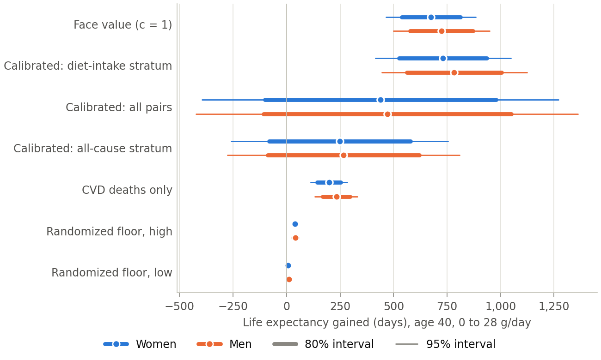
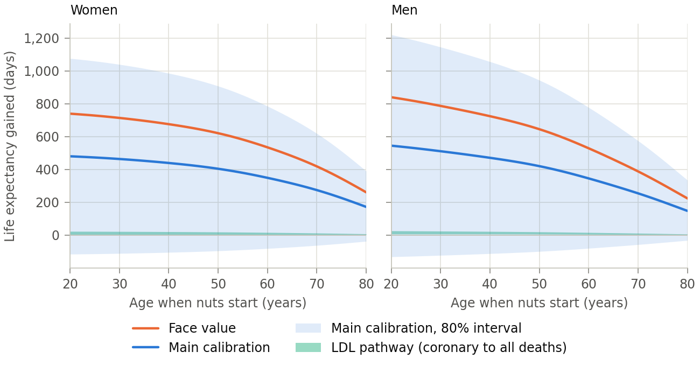
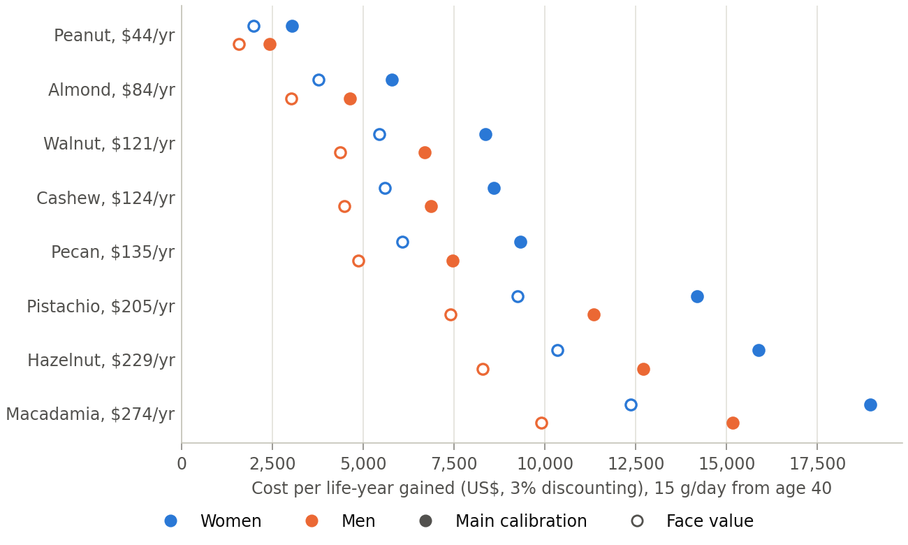

---
# GENERATED by paper/fill_paper.py from paper/index.qmd.in. Do not edit; edit the template.
title: "What nut?"
subtitle: "How much life a daily handful of nuts buys, and how little the kind matters"
author:
  - name: Max Ghenis
    email: max@maxghenis.com
    url: https://www.maxghenis.com
date: 2026-09-23
abstract: |
  Cohort studies that follow people for decades find that eating nuts goes with lower mortality, and that the association stops growing by about 15 grams a day. Randomized trials find that nuts lower LDL cholesterol by about the same amount per gram whichever tree nut is eaten. I turn both into remaining life expectancy with the 2023 US life tables and carry the unresolved question, how much of the cohort association nuts cause, as a bracket. For a 40-year-old man who eats no nuts, 15 grams a day adds 6 to 22 days through the LDL pathway alone, 267 days (80% interval −88 to 621) under a skeptical calibration of cohorts against trials, and 723 days, about 2.0 years, if the cohort association is causal. The calibration that matches the question, diet trials against diet cohorts, lands slightly above face value. A 40-year-old woman gains 4 to 675 days. Past 15 grams, the cohort curve adds nothing more. The evidence cannot rank walnuts, almonds, pistachios, pecans and hazelnuts; peanuts and cashews lack trial evidence that they lower LDL; and macadamias cost 6 times as much per gram as peanuts. How much you eat matters far more than which nut you choose.
---

# The question {#sec-question}

My breakfast carries three tablespoons of nuts across four kinds, walnuts, macadamias, almonds and hazelnuts, blended into a pudding adapted from Bryan Johnson's recipe. Two of the four, walnuts and macadamias, come from his recipe. I wanted to know what the nuts buy, whether the kinds matter, and what I would eat if I started over.

The question has three parts. How much remaining life does eating nuts buy for a US adult of a given age and sex who starts now and keeps going? How much do the next grams add for someone who already eats some? And does the kind of nut change the answer once price counts?

The estimand throughout is the change in remaining life expectancy, in undiscounted days or years, from sustaining an intake change of Δ grams a day on top of a background intake of B grams, starting at age $a_0$. Cost per life-year discounts both costs and life-years at 3%.

The hard part is not the arithmetic. It is how much of what cohorts observe the nuts cause. People who eat nuts differ from people who do not, and no trial has randomized nuts alone against no nuts and counted deaths. I do not pick one answer. I carry a floor built only from randomized evidence, two calibrations against how nutrition cohorts have compared with trials, and the cohort association at face value. Every result below comes as that bracket.

# What the evidence says {#sec-evidence}

## Cohorts: the association and its shape {#sec-cohorts}

The largest dose-response meta-analysis of prospective cohorts pooled 15 studies with 85,870 deaths among 819,448 people and found a relative risk of death of 0.78 (95% CI 0.72 to 0.84) per 28 grams a day of tree nuts and peanuts [@aune2016nut]. The linear number hides the shape. On the study's own nonlinear curve, the relative risk falls to 0.84 at 10 grams a day and 0.82 at 15 grams, then drifts back to 0.85 at 28 grams (@fig-dose-curves). The authors report no further reduction above 15 to 20 grams a day. IHME's Burden of Proof analysis of nuts and seeds against ischemic heart disease flattens earlier still: its mean relative risk reaches 0.757 by about 8 grams a day and stays there, and IHME rates the association two stars out of five [@zheng2022bop].

{#fig-dose-curves}

The association holds where the usual confounders run the other way. In the Golestan cohort in northeastern Iran, nut eaters smoked more, drank more, exercised less and weighed more than people who ate none, and still had a hazard of death of 0.71 (95% CI 0.58 to 0.86) at three or more servings a week [@eslamparast2017golestan]. Among low-income Black and white adults in the US South, the top fifth of nut and peanut intake had a hazard of 0.79 (95% CI 0.73 to 0.86) [@luu2015nut]. The same paper's Shanghai cohorts found 0.83 (95% CI 0.77 to 0.88) for the top fifth of peanut intake, but the whole association sat below about 3 grams a day with no gradient above it, a pattern dose alone does not explain.

The kind of nut barely separates in cohorts. In the Nurses' Health and Health Professionals Follow-up studies, peanuts twice a week or more went with a hazard of incident cardiovascular disease of 0.87 (95% CI 0.82 to 0.93), tree nuts 0.85 (95% CI 0.79 to 0.91), and walnuts once a week or more 0.81 (95% CI 0.71 to 0.92) [@guaschferre2017nut]. Peanut butter showed nothing there or in two other cohorts [@vandenbrandt2015nlcs; @luu2015nut].

Genetics adds little. A Mendelian randomization study in UK Biobank found no causal effect of any nut exposure on any cardiovascular outcome, with instruments too weak for the null to rule much out [@wang2025mr].

## Trials: LDL, and one trial with events {#sec-trials}

Controlled trials measure what nuts do to blood lipids. Across 61 trials lasting a median of four weeks, the change in LDL cholesterol from an ounce of tree nuts a day was −4.8 (95% CI −5.5 to −4.2) mg/dL. Restricted to randomized trials, it was −4.2 (95% CI −5.0 to −3.4) mg/dL for LDL and −4.2 (95% CI −5.7 to −2.6) mg/dL for apolipoprotein B, with no significant difference by type of tree nut [@delgobbo2015nuts]. That meta-analysis excluded peanuts. Meta-analyses of single nuts point the same way for walnuts, almonds, pistachios, pecans and hazelnuts, and find no significant LDL effect for cashews or peanuts (@tbl-nut-ldl).

| Nut                                  | LDL change, mg/dL                 | Source                   |
| :----------------------------------- | --------------------------------: | :----------------------- |
| Tree nuts, randomized trials (class) | −4.2 (95% CI −5.0 to −3.4)        | [@delgobbo2015nuts]      |
| Walnut                               | −5.5 (95% CI −7.7 to −3.3)        | [@guaschferre2018walnut] |
| Almond                               | −5.8 (95% CI −9.9 to −1.8)        | [@leebravatti2019almond] |
| Pistachio                            | −3.8 (95% CI −5.5 to −2.2)        | [@hadi2023pistachio]     |
| Pecan                                | −7.4 (95% CI −10.8 to −4.0)       | [@zhang2026pecan]        |
| Hazelnut                             | −5.8 (95% credible −11.9 to −0.1) | [@perna2016hazelnut]     |
| Macadamia                            | −4.7 (95% CI −14.3 to 4.8)        | [@jones2023macadamia]    |
| Cashew                               | −0.9 (95% CI −4.8 to 3.0)         | [@jalali2020cashew]      |
| Peanut                               | −3.3 (P = 0.47)                   | [@jafariazad2020peanut]  |

: LDL cholesterol change in controlled trials, by nut, as each meta-analysis reports it (mg/dL; hazelnut converted from mmol/L). Doses and comparators differ across meta-analyses. {#tbl-nut-ldl}

One trial counted cardiovascular events. PREDIMED randomized Spanish adults at high cardiovascular risk to a Mediterranean diet with 30 grams a day of mixed nuts (half walnuts, a quarter each hazelnuts and almonds), a Mediterranean diet with extra-virgin olive oil, or advice to cut fat. The nut arm's hazard of major cardiovascular events was 0.72 (95% CI 0.54 to 0.95); the olive-oil arm's was 0.69 (95% CI 0.53 to 0.91) [@estruch2018predimed]. The trial cannot separate the nuts from the rest of the diet, and the nut arm did no better than the olive-oil arm.

## How much of the association is causal {#sec-causal}

Two published tools bound the answer.

The first is the LDL pathway. The Cholesterol Treatment Trialists pooled randomized statin trials and estimated what each mmol/L of LDL lowering does to deaths: 0.80 (99% CI 0.74 to 0.87) for coronary deaths and 0.90 (95% CI 0.87 to 0.93) for deaths from any cause [@ctt2010ldl]. Multiplying the nut trials' randomized LDL effect by those slopes gives a floor: the benefit randomized evidence alone supports, if nuts act through LDL the way statins do per mmol/L. The floor ignores every other pathway, so it understates the effect if nuts do anything else.

The second is calibration. Schwingshackl and colleagues matched 71 pairs of nutrition trials and cohort studies that asked the same question and compared their relative risks [@schwingshackl2021agreement]. When both designs measured dietary intake, the trials' relative risks were 0.98 (95% CI 0.93 to 1.04) times the cohorts', a ratio indistinguishable from one. When trials of supplements were set against cohorts of blood levels, the ratio was 1.29 (95% CI 1.17 to 1.42): cohorts overstated the benefit. For all-cause mortality, a stratum dominated by supplement trials, it was 1.17 (95% CI 1.11 to 1.23). None of the 23 diet-against-diet pairs is a nut, though three concern ALA and three the Mediterranean diet.

Nuts are a food, so the matching stratum is diet against diet, and it says to take the cohort curve at face value; at the point estimates it scales the association by 1.08. The all-cause stratum is the skeptical reading: it keeps 37% of the association, and its prediction interval runs past zero. I report both, and the stratum that pools all 71 pairs.

# Model {#sec-model}

The baseline is the 2023 US life table for each sex [@arias2025lifetables]. From starting age $a_0$, intake moves from $B$ to $B + \Delta$ grams a day and stays there. The hazard of death at each later age $a$ is multiplied by

$$
M(a) = \exp\bigl(\varphi(a)\, c\, [f(B + \Delta) - f(B)]\bigr),
$$ {#eq-multiplier}

where $f(g)$ is the log relative risk at intake $g$, $c$ is the causal multiplier for the member of the bracket being computed, and $\varphi(a)$ ramps linearly from zero at $a_0$ to one 10 years later, the convention Fadnes and colleagues used [@fadnes2022food]. Remaining life expectancy with and without the change comes from the life table with the mid-year convention, and the model reproduces the table's own life expectancy within a day at every age.

The dose curve $f$ is Aune's nonlinear all-cause curve, held at its lowest relative risk once reached, so eating more is never modeled as harmful (@fig-dose-curves). Because $f$ flattens, the gain from Δ grams depends on $B$, and diminishing returns follow without any separate saturation term. The curve as printed, which turns up slightly past 20 grams, and the linear per-28 g estimate with a plateau are sensitivities.

The bracket has these members. The floor multiplies the randomized LDL change by the statin slopes, from low (coronary deaths only) to high (all deaths); peanuts use the peanut-specific LDL estimate. The calibrated members scale the cohort curve by one of Schwingshackl's ratios. Face value takes the cohort curve as published. A CVD-only member applies Aune's cardiovascular curve to cardiovascular deaths only, using 2023 cause-of-death shares by age and sex [@nchsmcd2023].

A Monte Carlo draw of 20,000 samples carries the uncertainty in the cohort relative risk, the calibration ratios (from their prediction intervals), the LDL effect and the statin slopes, with common random numbers across scenarios. Intervals are 80% unless noted.

The main model gives every nut the same effect per gram, because trials find no difference in LDL lowering among tree nuts and cohorts find none worth modeling. One sensitivity adds a channel for alpha-linolenic acid (ALA), the plant omega-3 walnuts carry and other nuts mostly do not, using the cohort estimate of 0.95 (95% CI 0.91 to 0.99) per gram a day and crediting only ALA inside the range those cohorts observed, 0.35 to 3.0 grams a day [@naghshi2021ala]. That estimate leans on smaller studies; with fixed effects it is 0.99. The average US adult already eats 1.93 grams of 18:3 fatty acids a day [@usdawweia1720].

The model reproduces its reference. With Fadnes's inputs for US adults starting at 20 (zero to 25 grams a day, relative risk 0.84, a ten-year phase-in), it gives 2.02 years for men against their 2.0, and 1.78 for women against their 1.7 [@fadnes2022food]. Their baseline was the Global Burden of Disease's 2019 US death rates; this model uses the 2023 life tables.

# Results {#sec-results}

## How much {#sec-how-much}

@tbl-reference gives every member of the bracket for a 40-year-old who starts eating 15 or 28 grams a day. On the cohort curve the two amounts buy the same, because the curve reaches its lowest point at 15 grams; only the randomized floor keeps growing with dose.

| Member of the bracket               | Women, 15 g       | Men, 15 g           | Women, 28 g       | Men, 28 g           |
| :---------------------------------- | ----------------: | ------------------: | ----------------: | ------------------: |
| Randomized floor, coronary deaths   | 4 (3 to 5)        | 6 (5 to 8)          | 7 (6 to 9)        | 12 (9 to 15)        |
| Randomized floor, all deaths        | 21 (16 to 26)     | 22 (17 to 27)       | 38 (29 to 48)     | 41 (31 to 51)       |
| CVD deaths only, face value         | 198 (143 to 253)  | 233 (168 to 297)    | 198 (143 to 253)  | 233 (168 to 297)    |
| Calibrated, all-cause stratum       | 249 (−82 to 579)  | 267 (−88 to 621)    | 249 (−82 to 579)  | 267 (−88 to 621)    |
| Calibrated, all 71 pairs            | 440 (−101 to 979) | 471 (−109 to 1,049) | 440 (−101 to 979) | 471 (−109 to 1,049) |
| Calibrated, diet stratum (matching) | 731 (525 to 937)  | 783 (563 to 1,004)  | 731 (525 to 937)  | 783 (563 to 1,004)  |
| Face value                          | 675 (539 to 812)  | 723 (578 to 870)    | 675 (539 to 812)  | 723 (578 to 870)    |

: Days of remaining life expectancy gained from starting to eat nuts at age 40 with no prior nut intake, by sex, amount and member of the bracket. Mean and 80% interval. {#tbl-reference}

The bracket is wide. At 15 grams a day, a 40-year-old man gains 6 to 22 days through the LDL pathway alone and 723 days at face value, about 33 times the high end of the floor. That spread is the state of the evidence: randomized trials establish a modest benefit through LDL, and cohorts observe one many times larger that nobody has randomized. The calibration that matches the question sides with the cohorts (@fig-bracket).

{#fig-bracket}

Starting later buys less. At face value, a man who starts at 30 gains 786 days, and one who starts at 70 gains 387 (@fig-by-age).

{#fig-by-age}

Most of the gain arrives with the first grams. For a 40-year-old man at face value, 10 grams a day buys 88% of what 15 grams buys (@fig-dose).

{#fig-dose}

## How much more {#sec-how-much-more}

Because the curve flattens by 15 grams, the next grams are worth less to someone who already eats nuts. For a 40-year-old man at face value, ten more grams a day add 635 days starting from none, 88 days starting from 10 grams, and 0 starting from 20; through the LDL pathway alone they add 15 days at any starting point (@fig-marginal). The average US adult eats about 12 grams of nuts and seeds on a given day [@usdafped1720], a mean that includes seeds and the many people who ate none that day.

{#fig-marginal}

Seeds complicate the background. Aune's exposure is tree nuts and peanuts; IHME's is nuts and seeds together. Someone who eats a tablespoon of ground flax and two of chia every morning, as I do, may already sit on the flat part of IHME's curve before counting a single nut.

## Which nut {#sec-which-nut}

The evidence does not rank the tree nuts. Their LDL effects per gram overlap (@tbl-nut-ldl), their cohort associations overlap, and no trial has compared hard outcomes between them. Walnuts have the most nut-specific cohort evidence, but their per-ounce estimates extrapolate well beyond what the top category ate, 5 to 7 grams a day [@guaschferre2017nut]. Peanuts match tree nuts in cohorts but not in lipid trials, and peanut butter shows no association anywhere. Cashews and macadamias have the weakest trial evidence.

Price separates them. At prices recorded on 23 September 2026 from warehouse, big-box and specialty sellers, the median qualifying price runs from $7.98 per kilogram for peanuts to $49.99 for macadamias. Because the main model gives every nut the same benefit per gram, cost per life-year follows price: at the matching calibration, from $2,740 per life-year for peanuts to $17,162 for macadamias, for a 40-year-old man eating 28 grams a day (@fig-cost).

{#fig-cost}

ALA is the one channel that could favor walnuts. For someone at the US average intake, 28 grams of walnuts adds 2.54 grams of ALA, of which 1.07 falls inside the range cohorts observed. Crediting it adds 200 days for a 40-year-old man at face value, on top of the class effect. That sensitivity assumes ALA's cohort association is causal and separate from the nut association, though walnut eaters sit inside the cohorts behind both. For someone whose seeds already supply 5 grams of ALA a day, walnut ALA adds nothing. And the trials of ALA found no effect on deaths: 1.01 (95% CI 0.84 to 1.20) [@abdelhamid2020omega3].

## Sensitivity {#sec-sensitivity}

@tbl-sensitivity varies one choice at a time for a 40-year-old man starting 28 grams a day.

| Choice                                          | Days, mean (80% interval) |
| :---------------------------------------------- | ------------------------: |
| Main case, face value                           | 723 (578 to 870)          |
| Calibrated, diet stratum                        | 783 (563 to 1,004)        |
| Dose curve as printed                           | 592 (473 to 712)          |
| Linear per-28 g estimate with plateau           | 906 (723 to 1,091)        |
| No phase-in                                     | 765 (612 to 921)          |
| Phase-in over 20 years                          | 673 (537 to 811)          |
| 2021 life tables and causes                     | 744 (594 to 896)          |
| CVD deaths only                                 | 233 (168 to 297)          |
| Randomized floor, all deaths, all 61 LDL trials | 47 (36 to 58)             |

: Days of remaining life expectancy gained, 40-year-old man, 0 to 28 grams a day, mean and 80% interval. Each row changes one choice from the main case. {#tbl-sensitivity}

The causal question moves the answer most, and the bracket already shows it. Among the other choices, restricting the association to cardiovascular deaths cuts the face-value gain to 32% of the all-cause figure, and the curve as printed trims it by 18%. The 2021 life tables, from a year when COVID-19 raised death rates, add 21 days.

# What would change the answer {#sec-flip}

Three kinds of evidence would move the bracket. A randomized trial of nuts alone against no nuts, large enough to count deaths, would replace the calibration with a measurement. Mendelian randomization with strong genetic instruments for nut intake would test the cohort association without its confounders. A lipid trial comparing peanuts or cashews head to head with tree nuts at matched doses would say whether the kind matters for the pathway we can measure.

Nothing in view would move the dose. Every source puts most of the association below 20 grams a day.

# Practical notes {#sec-practical}

Storage matters more than kind. Walnuts carry 47 grams of polyunsaturated fat per 100 grams, the most of the nine nuts in this paper, and ground walnut stored at room temperature for ten months oxidized more in air than under nitrogen, though no study has sampled it at the two-week horizon of a batch-prepared jar [@vidrih2012walnut]. Milled flaxseed stored 128 days at room temperature showed no significant rise in peroxides [@malcolmson2000flax]. Keeping walnuts whole and cold and grinding flax ahead is consistent with both. Roasting at high temperatures raised malondialdehyde, a marker of lipid oxidation, up to 17-fold in walnuts, and the authors recommend low to medium temperatures [@schlormann2015roasting].

Chia seeds eaten whole may pass through largely unabsorbed. In a ten-week trial, milled chia raised blood ALA by 58% and whole chia did not change it significantly [@nieman2012chia].

Brazil nuts are a selenium supplement more than a nut. A single kernel averages about 96 micrograms of selenium, and USDA's samples range twentyfold, from 136 to 2,740 micrograms per 100 grams [@usdafdc170569]. The European Food Safety Authority's upper limit for adults is 255 micrograms a day [@efsa2023selenium]; the US limit is 400 [@iom2000dri]. In a randomized trial of US adults, 200 micrograms a day raised the risk of type 2 diabetes, with a hazard of 1.55 (95% CI 1.03 to 2.33) [@stranges2007selenium]. I leave them out of the model.

FDA treats peanuts, pistachios, Brazil nuts and other tree nuts with more than 20 micrograms per kilogram of total aflatoxins as adulterated [@fdacpg570375]. Salted and roasted peanuts carried the only suggestive signal in the Mendelian randomization study, an odds ratio for ischemic heart disease of 1.49 (95% CI 1.05 to 2.11) that missed the paper's own significance threshold [@wang2025mr].

Nuts add calories: 183 kilocalories in 28 grams of walnuts, 162 in almonds. The model says nothing about what the nuts replace or what happens to body weight.

# Limitations {#sec-limitations}

The cohort curve comes from observational studies. The calibration that supports taking it at face value pools diet comparisons that include no nuts. The floor assumes nuts act only through LDL and act as statins do per mmol/L; both assumptions could be wrong in either direction. The baseline applies one year of US death rates to a person's whole remaining life. The model counts deaths, not quality of life. Prices are one day's, from one location.

# Reproducing this paper {#sec-reproduce}

A pipeline computes every number in this paper from checked evidence rows and fills the manuscript, which renders without running any code. The evidence table, data fetchers, model, tests and citation check (which resolves every DOI and matches its title and first author) are at [github.com/MaxGhenis/whatnut](https://github.com/MaxGhenis/whatnut).

# Appendix: evidence the model reads {#sec-appendix .appendix}

| Row                                      | Estimate (interval) | Source                        | Number checked in |
| :--------------------------------------- | ------------------: | :---------------------------- | :---------------- |
| `aune2016_allcause_per28g`               | 0.78 (0.72 to 0.84) | [@aune2016nut]                | full text         |
| `aune2016_cvd_per28g_mortality`          | 0.76 (0.67 to 0.86) | [@aune2016nut]                | full text         |
| `ctt2010_all_cause_per_mmol`             | 0.90 (0.87 to 0.93) | [@ctt2010ldl]                 | full text         |
| `ctt2010_chd_death_per_mmol`             | 0.80 (0.74 to 0.87) | [@ctt2010ldl]                 | full text         |
| `delgobbo2015_ldl_per28g`                | −4.8 (−5.5 to −4.2) | [@delgobbo2015nuts]           | full text         |
| `delgobbo2015_ldl_per28g_rct`            | −4.2 (−5 to −3.4)   | [@delgobbo2015nuts]           | full text         |
| `fadnes2022_us_men_25g`                  | 2 (1.7 to 2.3)      | [@fadnes2022food]             | full text         |
| `fadnes2022_us_women_25g`                | 1.7 (1.5 to 2)      | [@fadnes2022food]             | full text         |
| `jafariazad2020_peanut_ldl`              | −3.31               | [@jafariazad2020peanut]       | abstract          |
| `naghshi2021_ala_all_cause_per_g`        | 0.95 (0.91 to 0.99) | [@naghshi2021ala]             | full text         |
| `nchs_mortality_2023`                    | 3,090,964           | [@nchsmcd2023]                | data file         |
| `nvsr7406_life_tables_2023`              | citation only       | [@arias2025lifetables]        | full text         |
| `schwingshackl2021_rrr_all_cause`        | 1.17 (1.11 to 1.23) | [@schwingshackl2021agreement] | full text         |
| `schwingshackl2021_rrr_intake_vs_intake` | 0.98 (0.93 to 1.04) | [@schwingshackl2021agreement] | full text         |
| `schwingshackl2021_rrr_overall`          | 1.09 (1.04 to 1.14) | [@schwingshackl2021agreement] | full text         |
| `wweia_1720_ala_adults`                  | 1.93                | [@usdawweia1720]              | data file         |

: Every evidence row the model reads, with where its number was checked. {#tbl-evidence}
