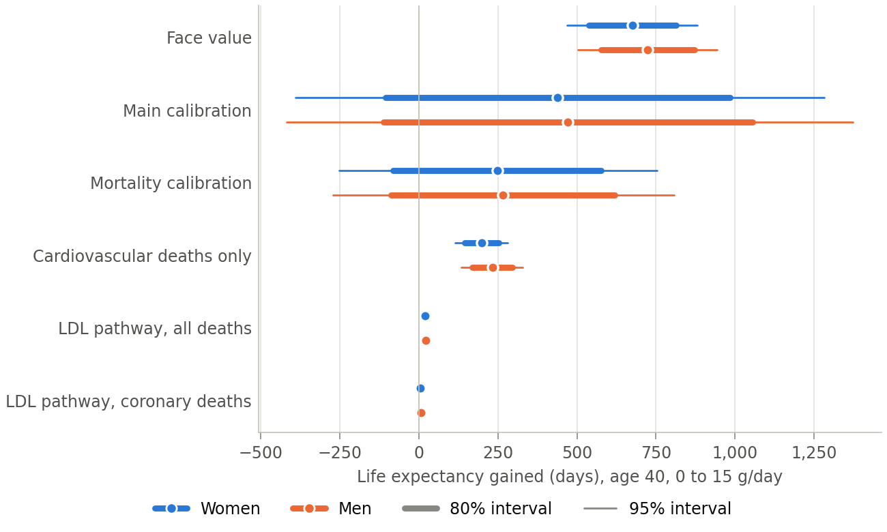
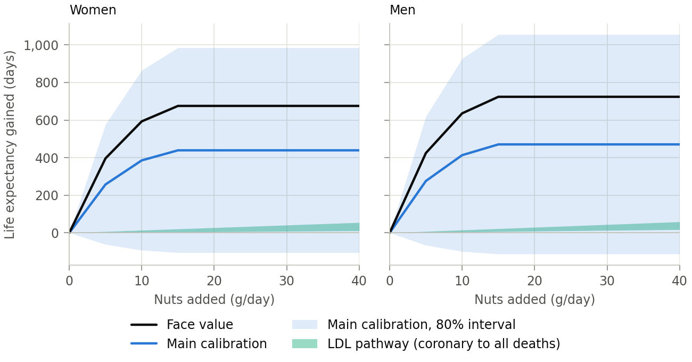
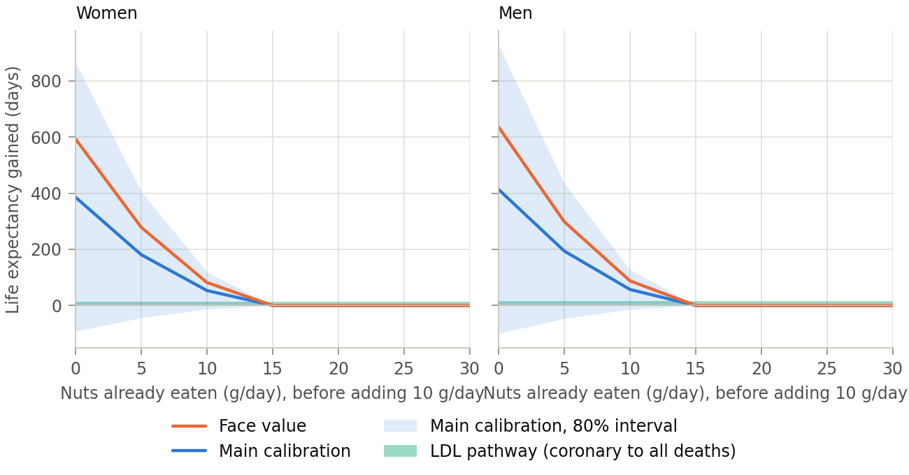

---
# GENERATED by paper/fill_paper.py from paper/index.qmd.in. Do not edit; edit the template.
title: "What nut?"
subtitle: "How much life nuts buy, and whether the kind matters"
author:
  - name: Max Ghenis
    email: max@maxghenis.com
    url: https://www.maxghenis.com
date: 2026-09-24
abstract: |
  Cohort studies find that people who eat nuts die at lower rates, and that the association stops growing by about 15 grams a day. Controlled trials find that tree nuts lower LDL cholesterol, with no significant difference among the kinds tested. I turn both into remaining life expectancy with the 2023 US life tables. No trial has measured how much of the cohort association nuts cause, so I report scenarios that run from randomized evidence alone to the cohort association at face value. For a 40-year-old man who eats no nuts, 15 grams a day adds 6 to 22 days through the LDL pathway alone, depending on whether it lowers coronary deaths only or deaths from every cause, and 724 days, about 2.0 years, if the cohort association is causal. Shrinking the association by how far trials and cohorts have disagreed in nutrition research gives 266 to 782 days, depending on which comparisons count; across all 71 comparisons it gives 470 days, with an 80% interval from −113 to 1,056 that includes harm. A 40-year-old woman gains 4 to 21 days through the LDL pathway, 439 (80% interval −105 to 985) across all 71 comparisons, and 675 at face value. The first 5 grams account for 59% of the face-value gain, and that step, from no nuts to some, is where the other ways nut eaters differ from non-eaters would inflate the association most. The evidence cannot rank walnuts, almonds, pistachios, pecans and hazelnuts; peanuts and cashews lack trial evidence that they lower LDL, and the two macadamia trials disagree; and macadamias cost 6 times as much per gram as peanuts.
---

# The question {#sec-question}

For breakfast I eat a pudding adapted from Bryan Johnson's recipe, with three tablespoons of nuts blended in: walnuts and macadamias from his recipe, and almonds and hazelnuts I added. I wanted to know what the nuts buy and whether the kinds matter.

How much remaining life does eating nuts buy a US adult of a given age and sex who starts now and keeps going? How much do the next grams add for someone who already eats some? And does the kind of nut change the answer once price counts? Fadnes and colleagues, taking the cohort association as causal, estimated that going from no nuts to 25 grams a day at age 20 adds 2.0 years of life for US men and 1.7 for women [@fadnes2022food].

I measure each answer as the change in remaining life expectancy, in undiscounted days or years, when someone who eats $B$ grams of nuts a day adds Δ grams at age $a_0$ and keeps eating them. Cohort analyses that adjust for total energy intake describe nuts eaten in place of other calories. Most lipid trials describe nuts added to the diet: of the 61 trials Del Gobbo and colleagues pooled, 47 gave nuts on top of a common background diet and 14 advised participants to keep calories constant [@delgobbo2015nuts]. I report results as nuts eaten in place of other calories; the LDL pathway rests mostly on trials that added them. Cost per life-year discounts both costs and life-years at 3%.

The hard part is causation. People who eat nuts differ from people who do not in ways that also affect how long they live, which is confounding, and no trial has randomized nuts alone against no nuts and counted deaths. So I report six scenarios, named as in @tbl-reference: the LDL pathway through coronary deaths and through all deaths, which use only randomized trials; the mortality calibration and the main calibration, which shrink the cohort association by how far nutrition cohorts have disagreed with trials; cardiovascular deaths only, which applies Aune's cardiovascular-mortality association to those deaths alone; and face value, which takes the all-cause association as causal.

# What the evidence says {#sec-evidence}

## Cohorts: the association and its shape {#sec-cohorts}

Aune and colleagues' 2016 dose-response meta-analysis of prospective cohorts, the source of the curve Fadnes and colleagues used, pooled 15 studies with 85,870 deaths among 819,448 people and found a relative risk of death of 0.78 (95% CI 0.72 to 0.84) per 28 grams a day of tree nuts and peanuts [@aune2016nut]. Studies with less than ten years of follow-up found 0.61 (95% CI 0.49 to 0.76), and those with ten or more found 0.84 (95% CI 0.79 to 0.90). People who fall ill often stop eating nuts, which makes eaters look healthier in the first years of follow-up; this reverse causation predicts what the short studies show. Two other explanations fit the same pattern: a single diet questionnaire at baseline measures intake worse the longer ago it was taken, which would make the long studies understate the association, and the two groups studied different people. Within studies, dropping the first years changed little: the Southern and Shanghai cohorts gave similar results after excluding people followed two years or less, and Golestan's held after excluding deaths in its first two years [@luu2015nut; @eslamparast2017golestan]. Smaller studies also reported stronger associations (Egger's test, P = 0.02); without the five smallest, the estimate is 0.80 (95% CI 0.74 to 0.87). A 2022 review of meta-analyses, two of whose authors also wrote Aune's analysis, reports Aune's estimate unchanged [@balakrishna2022umbrella], and a 2026 meta-analysis found 0.77 (95% CI 0.73 to 0.81) for the highest against the lowest intake [@liu2026nutmeta].

The 0.78 treats every gram alike. On the study's own nonlinear curve, the relative risk falls to 0.89 at 5 grams a day, 0.84 at 10 and 0.82 at 15, then drifts back to 0.85 at 28 grams (@fig-dose-curves). The authors report no further reduction above 15 to 20 grams a day. The Institute for Health Metrics and Evaluation's (IHME) Burden of Proof analysis of nuts and seeds against ischemic heart disease flattens earlier still: its mean relative risk reaches 0.757 by about 8 grams a day and stays there, and IHME rates the association two stars out of five, its grade for weak evidence [@ihmebop2026nutsihd], by the method of @zheng2022bop.

![Relative risk of death by grams of nuts a day. Orange points are Aune and colleagues' printed nonlinear estimates for all-cause mortality with 95% confidence intervals; the blue line is the model's curve, which holds them at their lowest value once reached. The dashed line, a sensitivity, is a smooth curve through the linear per-28 g estimate that reaches 90% of it by 15 grams. The green line and band are IHME's mean and uncertainty interval for nuts and seeds against ischemic heart disease, a different exposure and outcome.](figures/dose_curves.png){#fig-dose-curves}

The association also appears where some of the usual confounders run the other way. In the Golestan cohort in northeastern Iran, nut eaters smoked more, drank more, exercised less and weighed more than people who ate none, but they were also younger, wealthier, more urban and better educated, and they had a hazard ratio for death of 0.71 (95% CI 0.58 to 0.86) at three or more servings a week [@eslamparast2017golestan]. Among low-income Black and white adults in the US South, the top fifth of nut and peanut butter intake, 18 grams a day or more, had a hazard ratio of 0.79 (95% CI 0.73 to 0.86) [@luu2015nut]. The same paper's Shanghai cohorts found 0.83 (95% CI 0.77 to 0.88) for the top fifth of peanut intake.

The Shanghai cohorts also show where the association sits. The second fifth of peanut intake, 0.14 to 0.72 grams a day, already had 0.81 (95% CI 0.76 to 0.88), and the higher fifths ran from 0.78 to 0.83 [@luu2015nut]. The lowest fifth ate under 0.14 grams a day, so the contrast is mostly between people who ate almost no peanuts and everyone else; it is hard to see how under a gram of peanuts a day could cut deaths by a fifth.

Cohorts barely separate the kinds of nut. In the Nurses' Health and Health Professionals Follow-up studies, peanuts twice a week or more went with a hazard ratio for incident cardiovascular disease of 0.87 (95% CI 0.82 to 0.93), tree nuts 0.85 (95% CI 0.79 to 0.91), and walnuts once a week or more 0.81 (95% CI 0.71 to 0.92) [@guaschferre2017nut]. Peanut butter showed no association there or in the Netherlands Cohort Study [@vandenbrandt2015nlcs]. In the US Southern cohort its top fifth had a hazard ratio of 0.86 (95% CI 0.79 to 0.94), with no trend across fifths [@luu2015nut].

Mendelian randomization, which uses gene variants that shift nut intake as a natural experiment, adds little. One study, with genetic predictors of nut intake from UK Biobank and outcomes from FinnGen, found no effect of any nut exposure on any cardiovascular outcome that met its Bonferroni threshold (P < 0.0056), though its discussion says one did. Too few variants reached the usual significance threshold, so the study picked its genetic predictors at a relaxed one [@wang2025mr]. Salted or roasted peanuts gave its only suggestive signal, an odds ratio for ischemic heart disease of 1.49 (95% CI 1.05 to 2.11).

## Trials: LDL cholesterol, and one trial that counted heart attacks, strokes and deaths {#sec-trials}

Del Gobbo and colleagues pooled 61 controlled trials that fed a median of 56 grams a day for a median of 4 weeks. The change in LDL cholesterol, scaled to an ounce (28.4 grams) of tree nuts a day, was −4.8 (95% CI −5.5 to −4.2) mg/dL. Restricted to randomized trials, it was −4.2 (95% CI −5.0 to −3.4) mg/dL for LDL and −4.2 (95% CI −5.7 to −2.6) mg/dL for apolipoprotein B. The authors found no significant difference by type of tree nut, though two or fewer trials tested cashews, pecans or Brazil nuts [@delgobbo2015nuts]. That meta-analysis excluded peanuts. Meta-analyses of single nuts find LDL reductions for walnuts, almonds, pistachios, pecans and hazelnuts, and no significant effect for cashews or for peanuts and peanut products (@tbl-nut-ldl). The macadamia trials disagree: in a controlled-feeding trial, LDL was lower after a macadamia diet than after an average American diet, 3.14 against 3.44 mmol/L (P < 0.05), though that diet also cut saturated fat [@griel2008macadamia]; a free-living trial found no significant change [@jones2023macadamia].

| Nut                                 | LDL change, mg/dL                 | Source                   |
| :---------------------------------- | --------------------------------: | :----------------------- |
| Tree nuts pooled, randomized trials | −4.2 (95% CI −5.0 to −3.4)        | [@delgobbo2015nuts]      |
| Walnut                              | −5.5 (95% CI −7.7 to −3.3)        | [@guaschferre2018walnut] |
| Almond                              | −5.8 (95% CI −9.9 to −1.8)        | [@leebravatti2019almond] |
| Pistachio                           | −3.8 (95% CI −5.5 to −2.2)        | [@hadi2023pistachio]     |
| Pecan                               | −7.4 (95% CI −10.8 to −4.0)       | [@zhang2026pecan]        |
| Hazelnut                            | −5.8 (95% credible −11.9 to −0.1) | [@perna2016hazelnut]     |
| Macadamia, controlled feeding       | 3.14 vs 3.44 mmol/L (P < 0.05)    | [@griel2008macadamia]    |
| Macadamia, free-living trial        | −4.7 (95% CI −14.3 to 4.8)        | [@jones2023macadamia]    |
| Cashew                              | −0.9 (95% CI −4.8 to 3.0)         | [@jalali2020cashew]      |
| Peanut and peanut products          | −3.3 (P = 0.47)                   | [@jafariazad2020peanut]  |

: LDL cholesterol change in controlled trials, by nut (mg/dL; hazelnut converted from mmol/L). The pooled tree-nut row is per 28.4 grams a day; each nut row is a meta-analysis or a single trial at the doses its trials fed, against differing comparators. The pooled review ran under a contract funded by the International Tree Nut Council, the walnut and almond analyses were funded in part by the California Walnut Commission and the Almond Board of California, and the free-living macadamia trial by Hort Innovation, an Australian horticulture industry body. {#tbl-nut-ldl}

One trial counted cardiovascular events. PREDIMED assigned Spanish adults at high cardiovascular risk, most of them individually at random, to a Mediterranean diet with 30 grams a day of mixed nuts (half walnuts, a quarter each hazelnuts and almonds), a Mediterranean diet with extra-virgin olive oil, or advice to cut fat [@estruch2018predimed]. Its first report was withdrawn after some participants were found to have been assigned without randomization, and the 2018 reanalysis accounts for them. The nut arm's hazard ratio for major cardiovascular events was 0.72 (95% CI 0.54 to 0.95); the olive-oil arm's was 0.69 (95% CI 0.53 to 0.91). The benefit came mostly from stroke, 0.54 (95% CI 0.35 to 0.82). For death from any cause, the outcome this paper models, the nut arm's hazard ratio was 1.12 (95% CI 0.86 to 1.47), and for cardiovascular death 1.02 (95% CI 0.63 to 1.67). The trial cannot separate the nuts from the rest of the diet, and it tested little of the cohort curve's steep part: 71% of participants already ate nuts at baseline, a mean of about 10 grams a day, and the nut arm's intake rose by 16 grams a day while the control arm's fell by 3 [@guaschferre2013predimed]. If each arm's average change applied to everyone in it, the cohort curve at face value implies a hazard ratio for death of about 0.89 at full effect and 0.97 averaged over the trial's median 4.8 years with the model's ten-year phase-in (@sec-model); both lie inside the trial's interval. In the same participants, those who ate nuts more than three times a week at baseline had a hazard ratio for death of 0.61 (95% CI 0.45 to 0.83) against those who rarely or never did [@guaschferre2013predimed], an observational association the randomized comparison did not reproduce.

## How much of the association is causal {#sec-causal}

Randomized evidence gives one estimate through the LDL pathway. The Cholesterol Treatment Trialists pooled randomized statin trials and estimated what each mmol/L of LDL lowering does to deaths: 0.80 (99% CI 0.74 to 0.87) for coronary deaths and 0.90 (95% CI 0.87 to 0.93) for deaths from any cause [@ctt2010ldl]. The randomized nut trials' 4.2 mg/dL per ounce is 0.11 mmol/L (1 mmol/L is 38.67 mg/dL), so 15 grams a day lowers LDL by about 0.06 mmol/L. If nuts act through LDL the way statins do per mmol/L, that lowers the death rate by 0.6% and the coronary death rate by 1.3%, against 18% on the cohort curve. Trials that lowered LDL by diet and other non-statin means found 0.75 (95% CI 0.66 to 0.86) per mmol/L for major vascular events, against 0.77 (95% CI 0.71 to 0.84) for statins in the same analysis [@silverman2016ldl]. The estimate could be too low or too high. It leaves out every other pathway, and statin trials lasted about five years, while lower LDL sustained for decades appears to do more per mmol/L [@ference2017ldl]. But the randomized trials behind its LDL effect fed a median of 59.5 grams a day for 5.5 weeks, and the authors found larger effects at 60 grams a day or more, so scaling down to 15 grams may overstate it. The one two-year trial, of walnuts at about 15% of energy (30 to 60 grams a day) in older adults, a third of them on statins, found −4.3 (95% CI −6.6 to −1.6) mg/dL [@rajaram2021waha], at the low end of the −6.7 mg/dL the short trials imply at 45 grams.

Aune's cohorts also tie nuts to fewer deaths from causes nuts have no known route to. Per 28 grams a day, the relative risk was 0.25 (95% CI 0.07 to 0.85) for infectious disease, 0.27 (95% CI 0.04 to 1.91) for kidney disease, 0.48 (95% CI 0.26 to 0.89) for respiratory disease and 0.61 (95% CI 0.43 to 0.88) for diabetes, against 0.76 (95% CI 0.67 to 0.86) for cardiovascular death, the cause the lipid mechanism would most plausibly affect [@aune2016nut]. Associations that large with those causes point to confounding. Applied to cardiovascular deaths alone, Aune's cardiovascular-mortality association gives 32% of the face-value gain.

Calibration scales the cohort association by how nutrition cohorts have compared with trials of the same question. Schwingshackl and colleagues matched pairs of meta-analyses, one of trials and one of cohorts asking the same diet-disease question, and divided the trials' relative risk by the cohorts', a ratio of risk ratios [@schwingshackl2021agreement]. When the cohorts find a benefit, a ratio above 1 means the trials found less of it. Across the 71 pairs with binary outcomes, 48 of which involve supplements, the ratio was 1.09 (95% CI 1.04 to 1.14); its 95% prediction interval, the range expected for a new question such as nuts, runs from 0.81 to 1.46. Restricted to the 64 pairs whose cohort estimate was protective, as the nut association is, it was 1.12 (95% CI 1.07 to 1.17) (the protective-pairs calibration). For all-cause mortality, a stratum in which 7 of its 15 pairs test supplements alone and 4 more mix supplements with dietary advice, it was 1.17 (95% CI 1.11 to 1.23) (the mortality calibration). When both designs measured dietary intake, it was 0.98 (95% CI 0.93 to 1.04) (the diet calibration). Those 23 pairs include pregnancy outcomes and colorectal adenomas, but the 15 without them pool to 0.97 (95% CI 0.92 to 1.03), and the 19 whose cohort estimate was protective pool to 1.00 (95% CI 0.93 to 1.07). So the ratios above 1 come from supplement comparisons; supplement trials against cohorts of blood levels alone give 1.29 (95% CI 1.17 to 1.42). The authors caution that the ratio shows a difference between bodies of evidence, and that its direction depends on the direction of the underlying effects. No pair concerns nuts. The six nearest, three on alpha-linolenic acid (ALA, the plant omega-3 in walnuts) and three on the Mediterranean diet, pool to 1.07 (95% CI 0.98 to 1.18) (the nearest-pairs calibration), but they rest on two sources of trial evidence, the Mediterranean-diet trial evidence is PREDIMED with its nut and olive-oil arms combined, and the six show no variation beyond chance, so their prediction interval carries none.

I apply a ratio by asking what share $c$ of the cohort association survives if trials of nuts would differ from the cohorts by that ratio:

$$
c = \frac{\ln(RR_{28} \cdot RRR)}{\ln RR_{28}},
$$ {#eq-calibration}

where $RR_{28}$ is Aune's linear estimate per 28 grams, 0.78, and $RRR$ is the ratio of risk ratios. In the simulation (@sec-model), each draw of $RRR$ from its prediction interval is paired with the same draw of $RR_{28}$ that scales the curve. I take all 71 pairs as the main calibration because it picks no subset of comparisons: it keeps 65% of the association. The diet pairs alone would keep all of it, and the mortality calibration keeps 37%. Both prediction intervals include ratios large enough to reverse the association, so in 15% of the main calibration's draws and 17% of the mortality calibration's, nuts do harm. The five calibrations in @tbl-calibration keep between 37% and 108%. The formula measures the ratio against Aune's linear estimate; the model's curve reaches only 0.82 at 28 grams, so measured against the curve (the table's last columns) the same ratio removes a larger share of its smaller effect: the main calibration keeps 57% and the mortality calibration 21%.

| Calibration                  | Pairs | Ratio (95% prediction interval) | Share kept, linear anchor | Days, linear anchor | Share kept, curve anchor | Days, curve anchor  |
| :--------------------------- | ----: | ------------------------------: | ------------------------: | ------------------: | -----------------------: | ------------------: |
| Mortality calibration        | 15    | 1.17 (0.99 to 1.39)             | 37%                       | 266 (−88 to 619)    | 21%                      | 151 (−278 to 581)   |
| Protective-pairs calibration | 64    | 1.12 (0.87 to 1.45)             | 54%                       | 396 (−114 to 906)   | 43%                      | 313 (−313 to 941)   |
| Main calibration             | 71    | 1.09 (0.81 to 1.46)             | 65%                       | 470 (−113 to 1,056) | 57%                      | 407 (−315 to 1,131) |
| Nearest-pairs calibration    | 6     | 1.07 (0.94 to 1.22)             | 72%                       | 523 (232 to 812)    | 65%                      | 473 (126 to 818)    |
| Diet calibration             | 23    | 0.98 (0.90 to 1.07)             | 108%                      | 782 (562 to 1,007)  | 110%                     | 797 (545 to 1,055)  |

: Calibrations of the cohort association against Schwingshackl and colleagues' trial-cohort pairs, and days of remaining life expectancy gained by a 40-year-old man from 15 grams a day with no prior nuts, mean and 80% interval. The share kept is $c$ at the point estimates, measured against Aune's linear estimate or against the model's curve at 28 grams. {#tbl-calibration}

# Model {#sec-model}

The baseline is the 2023 US life table for each sex [@arias2025lifetables]. From starting age $a_0$, intake moves from $B$ to $B + \Delta$ grams a day and stays there. For the cohort-curve scenarios, the hazard of death at each later age $a$ is multiplied by

$$
M(a) = \exp\bigl(\varphi(a)\, c\, [f(B + \Delta) - f(B)]\bigr),
$$ {#eq-multiplier}

where $f(g)$ is the log relative risk at intake $g$, $c$ is the share of the association the scenario treats as causal, and the phase-in $\varphi(a)$ ramps linearly from zero at $a_0$ to one 10 years later, the convention Fadnes and colleagues used [@fadnes2022food]. Remaining life expectancy with and without the change comes from the life table with the mid-year convention; the model reproduces the table's own life expectancy within a day at every age.

The dose curve $f$ is Aune's nonlinear all-cause curve, held at its lowest relative risk once reached (@fig-dose-curves), so on the curve itself more nuts never raise risk; only a calibration draw that reverses the association makes them harmful. Because $f$ flattens, the gain from Δ grams depends on $B$: ten grams added to ten buy less than ten grams added to none. The curve is steepest over its first 5 grams, about 4 almonds [@usdasrlegacy2018], which account for 59% of the face-value gain at 15 grams.

Through the LDL pathway, the full-effect log multiplier is $\beta = \ln S$ times the LDL reduction in mmol/L, where $S$ is the Cholesterol Treatment Trialists' rate ratio per mmol/L and the reduction is Del Gobbo's randomized per-28.4-gram change, scaled linearly to Δ and converted from mg/dL to mmol/L. With the all-cause slope it multiplies every death's hazard by $\exp(\varphi(a)\beta)$. The LDL pathway through coronary deaths and the cardiovascular-deaths-only scenario act only on one cause's share $p(a)$ of deaths,

$$
M(a) = 1 - p(a) + p(a)\exp\bigl(\varphi(a)\,\beta\bigr),
$$ {#eq-cause}

where $p(a)$ is the 2023 share of coronary (ICD-10 I20–I25) or all cardiovascular (I00–I99) deaths for the person's sex and ten-year age group [@nchsmcd2023], and $\beta$ is the LDL multiplier or, for cardiovascular deaths only, $f_{\mathrm{CVD}}(B+\Delta) - f_{\mathrm{CVD}}(B)$ on Aune's cardiovascular-mortality curve, also held at its lowest relative risk once reached, with $c = 1$.

I run 20,000 Monte Carlo draws. Each draw scales the whole cohort curve by a lognormal draw of Aune's linear per-28 g estimate (the cardiovascular curve by its own), not by the pointwise intervals in @fig-dose-curves, and draws the calibration ratios from their prediction intervals, the LDL effect, the statin slopes and the ALA slope. Every scenario uses the same draws. The face-value interval reflects uncertainty in Aune's pooled mean only, not the variation between his studies (I² = 66%), so it is narrower than the calibrated scenarios' by construction. Intervals are 80% unless noted.

The model gives every nut the same effect per gram: trials find no significant difference in LDL lowering among tree nuts, and cohorts find peanuts and tree nuts about equal. One sensitivity adds a channel for ALA, which walnuts have and other nuts mostly lack, using the cohort estimate of 0.95 (95% CI 0.91 to 0.99) per gram a day and crediting only ALA inside the range those cohorts observed, 0.35 to 3.0 grams a day [@naghshi2021ala]. Smaller studies pull that estimate down; a fixed-effect model, which weights studies by precision, gives 0.99 (95% CI 0.98 to 1.01). US men eat 2.16 grams of ALA a day and women 1.72, counting all 18:3 fatty acids [@usdawweia1720].

Other sensitivities measure the curve from 5 grams, so the step from none to some counts for nothing; rescale it to the cohorts with ten or more years of follow-up and to the estimate without the smallest studies, recomputing each calibration's share against the rescaled estimate; replace it with a smooth curve through the linear per-28 g estimate, $f(g) = \ln 0.78 \cdot (1 - e^{-g/k})/(1 - e^{-28/k})$ with $k$ set so the curve reaches 90% of the 28-gram effect at 15 grams; leave deaths from external causes (ICD-10 V01–Y89), 54% of deaths of men aged 35 to 44 in 2023, out of the multiplier; let the log relative risk fall linearly from full strength at 65 to half at 85 and stay at half, a modeling choice for an association otherwise held constant to age 100; change the phase-in; use the 2021 life tables; and use all 61 LDL trials, randomized or not. The cohorts observed mostly deaths after 60, so the age variant weakens the association where it was measured; it is a lower case, not a correction.

With Fadnes and colleagues' inputs for US adults starting at 20 (zero to 25 grams a day, relative risk 0.84, a ten-year phase-in), the model gives 2.02 years for men against their 2.0, and 1.78 for women against their 1.7. Starting at 80 the match is looser: 0.62 years for women against their 0.5. Their baseline was the Global Burden of Disease's 2019 US death rates; this model uses the 2023 life tables. The check covers the life table and the phase-in, not the dose curve or the calibration.

# Results {#sec-results}

## How much {#sec-how-much}

On the model's curve, which holds Aune's lowest relative risk from 15 grams on, 15 and 28 grams a day buy the same for a 40-year-old; only the LDL pathway keeps growing with dose (@tbl-reference).

| Scenario                     | Women, 15 g       | Men, 15 g           | Women, 28 g       | Men, 28 g           |
| :--------------------------- | ----------------: | ------------------: | ----------------: | ------------------: |
| LDL pathway, coronary deaths | 4 (3 to 5)        | 6 (5 to 8)          | 7 (6 to 9)        | 12 (9 to 15)        |
| LDL pathway, all deaths      | 21 (16 to 26)     | 22 (17 to 27)       | 38 (29 to 48)     | 41 (31 to 51)       |
| Cardiovascular deaths only   | 198 (144 to 252)  | 233 (169 to 296)    | 198 (144 to 252)  | 233 (169 to 296)    |
| Mortality calibration        | 248 (−82 to 578)  | 266 (−88 to 619)    | 248 (−82 to 578)  | 266 (−88 to 619)    |
| Main calibration             | 439 (−105 to 985) | 470 (−113 to 1,056) | 439 (−105 to 985) | 470 (−113 to 1,056) |
| Face value                   | 675 (538 to 814)  | 724 (577 to 872)    | 675 (538 to 814)  | 724 (577 to 872)    |

: Days of remaining life expectancy gained from starting to eat nuts at age 40 with no prior nut intake, by scenario, sex and amount. Mean and 80% interval. {#tbl-reference}

The scenarios span two orders of magnitude. At 15 grams a day, a 40-year-old man gains 6 to 22 days through the LDL pathway, 233 from cardiovascular deaths only, 266 at the mortality calibration, 470 at the main calibration and 724 at face value (@fig-scenarios). Randomized evidence on LDL supports about 1 to 3 weeks of life; the cohort association, taken as causal, implies about 2.0 years, which no trial has tested. The gain scales in proportion to $c$: at $c$ of 0.1 and 0.33, the man gains 72 and 239 days.

{#fig-scenarios}

Starting later buys less. At the main calibration, a man who starts at 30 gains 511 days and one who starts at 70 gains 254; at face value, 786 and 388 (@fig-by-age).

{#fig-by-age}

Most of the modeled gain arrives with the first grams. For a 40-year-old man at face value, 5 grams a day buys 59% of what 15 grams buys, and 10 grams 88% (@fig-dose).

{#fig-dose}

## How much more {#sec-how-much-more}

Because the curve flattens by 15 grams, the next grams are worth less to someone who already eats nuts. For a 40-year-old man, ten more grams a day add 413, 57 and 0 days at the main calibration, starting from none, 10 and 20 grams; at face value, 636, 88 and 0 (@fig-marginal). From 15 grams on, only the LDL pathway still adds days, 4 through coronary deaths and 15 through all deaths, at any starting point, because the model scales the trials' LDL effect linearly with dose while the cohort curve is flat. The average US adult eats about 12 grams of nuts and seeds on a given day [@usdafped1720; @usdafped1718method], a mean that counts the many people who ate none that day.

{#fig-marginal}

Aune's exposure is tree nuts and peanuts; IHME's is nuts and seeds together, so on IHME's curve seeds count toward what someone already eats. I eat a tablespoon of ground flax and two of chia every morning. By USDA's composition data, the flax alone supplies about 1.6 grams of ALA; with the average man's 2.16 grams from the rest of the diet, that passes the 3.0 grams at the top of the range the ALA cohorts observed.

## Which nut {#sec-which-nut}

The evidence does not rank the tree nuts. Their LDL effects at the doses trialed overlap (@tbl-nut-ldl), their cohort associations overlap, and no trial has compared hard outcomes between them. Walnuts have the most nut-specific cohort evidence, but the top walnut categories in those cohorts ate a median of only 5 to 7 grams a day [@guaschferre2017nut]. Peanuts match tree nuts in cohorts, but trials of peanuts and peanut products have not shown that they lower LDL, and peanut butter shows no consistent association. Cashews have the weakest trial evidence, and the macadamia trials disagree.

Price separates them. On 23 September 2026, the median price per kilogram across one to four warehouse, big-box and specialty sellers per nut ran from $7.98 for peanuts to $49.99 for macadamias. Because the model gives every nut the same benefit per gram, cost per life-year follows price. For a 40-year-old man eating 15 grams a day it runs from about $2,400 for peanuts to $15,200 for macadamias at the main calibration, and from $1,600 to $9,900 at face value (@fig-cost). Through the LDL pathway alone, counting all deaths, it runs from $94,500 for almonds to $309,500 for macadamias. At 28 grams the extra 13 grams cost more and, on the model's curve, buy nothing. Peanuts come out cheapest on the strength of their cohort association; their lipid trials found no significant LDL effect.

{#fig-cost}

ALA is the one channel that could favor walnuts. For a man at the US average, 15 grams of walnuts adds 1.36 grams of 18:3 fatty acids, nearly all ALA [@usdasrlegacy2018], of which 0.84 falls inside the range cohorts observed. Crediting it adds 157 days at face value (80% interval 73 to 242) on top of the effect every nut gets, or 31 with the fixed-effect estimate, which gives less weight to the small studies behind the larger figure; at the main calibration, 101 and 20. The sensitivity assumes ALA's cohort association is causal and separate from the nut association, though walnut eaters sit inside the cohorts behind both. For someone whose diet already supplies 5 grams of ALA a day, walnut ALA adds nothing. Randomized trials of ALA found little or no difference in deaths, from five trials with 459 deaths: a risk ratio of 1.01 (95% CI 0.84 to 1.20) [@abdelhamid2020omega3].

My flax already puts me past the ALA range, so on this model walnut ALA adds nothing for me. Macadamias, the other nut my pudding takes from Johnson's recipe, cost the most per life-year, and their two LDL trials disagree.

## Sensitivity {#sec-sensitivity}

Of the choices in @tbl-sensitivity, treating the step from none to 5 grams as confounded moves the answer most: measuring the curve from 5 grams keeps 41% of the face-value gain. Rescaling the curve to the cohorts followed ten years or more keeps 70%, leaving out external causes of death keeps 89%, and letting the log relative risk fall to half between 65 and 85 keeps 79%. The smooth curve through the per-28 g estimate raises it by 13%. Aune's printed curve, which turns back up past 20 grams, changes nothing at 15 grams and gives 592 days at 28 grams against the model's 724. The 2021 life tables, from a year when COVID-19 raised death rates, add 20 days. The cardiovascular-deaths-only scenario in @tbl-reference keeps 32%.

| Choice                                            | Face value       | Main calibration    | LDL pathway, all deaths |
| :------------------------------------------------ | ---------------: | ------------------: | ----------------------: |
| Default choices                                   | 724 (577 to 872) | 470 (−113 to 1,056) | 22 (17 to 27)           |
| Curve measured from 5 g (none to some not causal) | 298 (238 to 359) | 194 (−47 to 435)    | —                       |
| Smooth curve through the per-28 g estimate        | 816 (650 to 983) | 530 (−127 to 1,190) | —                       |
| Cohorts followed ten years or more                | 508 (384 to 633) | 255 (−323 to 834)   | —                       |
| Without the five smallest studies                 | 650 (496 to 806) | 397 (−188 to 983)   | —                       |
| External causes of death left out                 | 644 (514 to 775) | 418 (−101 to 938)   | 20 (15 to 24)           |
| Log relative risk falls to half from 65 to 85     | 571 (458 to 685) | 369 (−92 to 823)    | 18 (14 to 22)           |
| No phase-in                                       | 766 (611 to 923) | 497 (−120 to 1,116) | 23 (18 to 29)           |
| Phase-in over 20 years                            | 673 (536 to 812) | 438 (−104 to 985)   | 20 (15 to 25)           |
| 2021 life tables                                  | 744 (593 to 897) | 484 (−116 to 1,087) | 23 (17 to 28)           |
| All 61 LDL trials, randomized or not              | —                | —                   | 25 (19 to 31)           |

: Days of remaining life expectancy gained, 40-year-old man, 0 to 15 grams a day, mean and 80% interval. Each row below the first changes one of the default choices in @sec-model; a dash marks a scenario the sensitivity is not applied to. In the rescaled rows, the main calibration's share is recomputed against each row's own per-28 g estimate. {#tbl-sensitivity}

# What would change the answer {#sec-flip}

Three kinds of evidence would narrow the scenarios. A randomized trial of nuts alone against no nuts, large enough to count deaths, would test the cohort association directly, though over a few years it could only bound an effect that the model phases in over a decade. Studies of people who change what they eat come closest now: in the Nurses' Health and Health Professionals cohorts, each half serving a day more over four years went with a relative risk of cardiovascular disease of 0.92 (95% CI 0.86 to 0.98), and people who went from no nuts to half a serving a day or more had 0.83, with each cohort's interval crossing one [@liu2020nutchange]. Mendelian randomization with strong genetic predictors of nut intake would test the cohort association free of its behavioral confounders. A lipid trial comparing peanuts or cashews head to head with tree nuts at matched doses would say whether the kind matters for the pathway trials can measure.

Every cohort source puts most of the association below 20 grams a day, but the LDL pathway, the part trials support, grows with dose, so the dose that buys the most depends on how much of the association is causal.

# Practical notes {#sec-practical}

Polyunsaturated fat is the fat that oxidizes, and walnuts have 47 grams of it per 100 grams, the most of the nine nuts in this paper [@usdasrlegacy2018]. In ground walnut sealed at 20 °C for ten months, its ALA tended to fall and polyphenols were lower under oxygen than under nitrogen, though most oxidation products did not differ significantly [@vidrih2012walnut]. Milled flaxseed stored 128 days at room temperature showed no significant rise in peroxides [@malcolmson2000flax]. Neither study tested whole nuts or cold storage. Roasting at high temperatures raised malondialdehyde, a marker of lipid oxidation, up to 17-fold in walnuts, and the authors recommend low to medium temperatures [@schlormann2015roasting].

Whole chia may deliver less ALA than milled chia. In a ten-week trial of 25 grams a day in overweight postmenopausal women, milled chia raised plasma ALA by 58% and whole chia did not change it significantly [@nieman2012chia]; the trial measured blood ALA, not absorption.

A single Brazil nut kernel averages about 96 micrograms of selenium, and USDA's samples range twentyfold, from about 7 to 137 micrograms a kernel [@usdafdc170569]. Three average kernels exceed the European Food Safety Authority's upper limit for adults, 255 micrograms a day [@efsa2023selenium]; the US limit is 400 [@iom2000dri]. In a secondary analysis of a randomized trial in US dermatology patients, 200 micrograms a day of selenium went with more type 2 diabetes, a hazard ratio of 1.55 (95% CI 1.03 to 2.33) [@stranges2007selenium]; the larger SELECT trial found a smaller, nonsignificant increase, 1.07 (99% CI 0.94 to 1.22) [@lippman2009select]. I leave Brazil nuts out of the model.

Nuts add calories: 183 kilocalories in 28 grams of walnuts, 162 in almonds [@usdasrlegacy2018]. The estimates here assume they replace other calories (@sec-question). About 1 to 2% of adults are allergic to nuts [@balakrishna2022umbrella]; none of these estimates applies to them.

# Limitations {#sec-limitations}

Face value assumes the cohort association is causal. Its steepest part is the contrast between people who eat any nuts and people who eat none, and its associations with deaths from infections and kidney disease are stronger than with cardiovascular death. Every cohort measured intake with a food questionnaire, so the grams on the dose axis are reported grams; reporting error, and lowest categories such as "never or almost never", blur the step from none to some. The face-value interval leaves out the variation between studies. No calibration pair concerns nuts; which comparisons count moves the calibrated answer from 266 to 782 days, the main calibration's 80% interval includes harm, and how a ratio of risk ratios maps onto a dose curve moves the mortality calibration from 266 to 151 days. The LDL pathway assumes nuts act as statins do per mmol/L and rests on short trials at high doses; it could be wrong in either direction. In the default choices the relative risk holds to age 100 and applies to every cause of death; the sensitivities that relax these keep 79% and 89% of the face-value gain. Much of the lipid evidence was funded in part by nut industry bodies. The baseline applies one year of US death rates to a person's whole remaining life. The model counts deaths, not quality of life. Prices come from one day, 23 September 2026, from stores in Washington, DC and online sellers.

# Reproducing this paper {#sec-reproduce}

A pipeline computes every model result in this paper from the evidence rows in @tbl-evidence and hash-checked data files, and writes those results and every estimate quoted from data/evidence.yaml into the text. I typed study sizes, trial counts and other figures quoted from sources from the notes of rows in data/evidence.yaml, each of which records where its number was checked. The rows, data fetchers, model, tests and a citation check that resolves every DOI and matches its title and first author are at [github.com/MaxGhenis/whatnut](https://github.com/MaxGhenis/whatnut/tree/r2-20260924).

# Appendix: evidence the model reads {#sec-appendix .appendix}

| Row                                               | Measure                               | Estimate (95% CI unless noted)                        | Source                        | Checked against |
| :------------------------------------------------ | :------------------------------------ | ----------------------------------------------------: | :---------------------------- | :-------------- |
| `aune2016_allcause_fu10plus`                      | RR, per 28 g/day                      | 0.84 (0.79 to 0.90)                                   | [@aune2016nut]                | full text       |
| `aune2016_allcause_per28g`                        | RR, per 28 g/day                      | 0.78 (0.72 to 0.84)                                   | [@aune2016nut]                | full text       |
| `aune2016_allcause_per28g_excl_small_studies`     | RR, per 28 g/day                      | 0.80 (0.74 to 0.87)                                   | [@aune2016nut]                | full text       |
| `aune2016_cvd_per28g_mortality`                   | RR, per 28 g/day                      | 0.76 (0.67 to 0.86)                                   | [@aune2016nut]                | full text       |
| `ctt2010_all_cause_per_mmol`                      | RR, per 1.0 mmol/L LDL-C reduction    | 0.90 (0.87 to 0.93)                                   | [@ctt2010ldl]                 | full text       |
| `ctt2010_chd_death_per_mmol`                      | RR, per 1.0 mmol/L LDL-C reduction    | 0.80 (99% CI 0.74 to 0.87)                            | [@ctt2010ldl]                 | full text       |
| `delgobbo2015_ldl_per28g`                         | Mean difference, mg/dL per 28.4 g/day | −4.8 (−5.5 to −4.2)                                   | [@delgobbo2015nuts]           | full text       |
| `delgobbo2015_ldl_per28g_rct`                     | Mean difference, mg/dL per 28.4 g/day | −4.2 (−5.0 to −3.4)                                   | [@delgobbo2015nuts]           | full text       |
| `fadnes2022_us_men_25g`                           | Value, years                          | 2.0 (1.7 to 2.3)                                      | [@fadnes2022food]             | full text       |
| `fadnes2022_us_women_25g`                         | Value, years                          | 1.7 (1.5 to 2.0)                                      | [@fadnes2022food]             | full text       |
| `guaschferre2013_predimed_baseline_nuts_1to3`     | Value, g/day                          | 4.9                                                   | [@guaschferre2013predimed]    | full text       |
| `guaschferre2013_predimed_baseline_nuts_never`    | Value, g/day                          | 0                                                     | [@guaschferre2013predimed]    | full text       |
| `guaschferre2013_predimed_baseline_nuts_over3`    | Value, g/day                          | 25.7                                                  | [@guaschferre2013predimed]    | full text       |
| `guaschferre2013_predimed_nut_change_control_arm` | Value, g/day                          | −3.12                                                 | [@guaschferre2013predimed]    | full text       |
| `guaschferre2013_predimed_nut_change_nut_arm`     | Value, g/day                          | 15.95                                                 | [@guaschferre2013predimed]    | full text       |
| `jafariazad2020_peanut_ldl`                       | Mean difference, mg/dL                | −3.31 (P = 0.47)                                      | [@jafariazad2020peanut]       | abstract        |
| `naghshi2021_ala_all_cause_per_g`                 | RR, per 1 g/day ALA                   | 0.95 (0.91 to 0.99)                                   | [@naghshi2021ala]             | full text       |
| `naghshi2021_ala_all_cause_per_g_fixed`           | RR, per 1 g/day ALA                   | 0.99 (0.98 to 1.01)                                   | [@naghshi2021ala]             | full text       |
| `nchs_mortality_2023`                             | Value, deaths                         | 3,090,964                                             | [@nchsmcd2023]                | data file       |
| `nvsr7406_life_tables_2023`                       | Value, years                          | citation only                                         | [@arias2025lifetables]        | full text       |
| `predimed2018_nuts_all_cause_death`               | HR                                    | 1.12 (0.86 to 1.47)                                   | [@estruch2018predimed]        | full text       |
| `schwingshackl2021_pair_ala_chd`                  | Ratio of risk ratios                  | 1.10 (0.89 to 1.35)                                   | [@schwingshackl2021agreement] | full text       |
| `schwingshackl2021_pair_ala_cvd`                  | Ratio of risk ratios                  | 1.02 (0.87 to 1.20)                                   | [@schwingshackl2021agreement] | full text       |
| `schwingshackl2021_pair_ala_cvd_mortality`        | Ratio of risk ratios                  | 1.13 (0.85 to 1.51)                                   | [@schwingshackl2021agreement] | full text       |
| `schwingshackl2021_pair_med_all_cause`            | Ratio of risk ratios                  | 1.12 (0.90 to 1.39)                                   | [@schwingshackl2021agreement] | full text       |
| `schwingshackl2021_pair_med_cv_events`            | Ratio of risk ratios                  | 1.00 (0.78 to 1.28)                                   | [@schwingshackl2021agreement] | full text       |
| `schwingshackl2021_pair_med_cvd_mortality`        | Ratio of risk ratios                  | 1.27 (0.81 to 2.00)                                   | [@schwingshackl2021agreement] | full text       |
| `schwingshackl2021_rrr_all_cause`                 | Ratio of risk ratios                  | 1.17 (1.11 to 1.23); prediction interval 0.99 to 1.39 | [@schwingshackl2021agreement] | full text       |
| `schwingshackl2021_rrr_intake_vs_intake`          | Ratio of risk ratios                  | 0.98 (0.93 to 1.04); prediction interval 0.90 to 1.07 | [@schwingshackl2021agreement] | full text       |
| `schwingshackl2021_rrr_overall`                   | Ratio of risk ratios                  | 1.09 (1.04 to 1.14); prediction interval 0.81 to 1.46 | [@schwingshackl2021agreement] | full text       |
| `schwingshackl2021_rrr_overall_cohort_rr_below_1` | Ratio of risk ratios                  | 1.12 (1.07 to 1.17); prediction interval 0.87 to 1.45 | [@schwingshackl2021agreement] | full text       |
| `wweia_1720_ala_men`                              | Value, g/day                          | 2.16                                                  | [@usdawweia1720]              | data file       |
| `wweia_1720_ala_women`                            | Value, g/day                          | 1.72                                                  | [@usdawweia1720]              | data file       |

: Every evidence row the model reads, with where its number was checked. {#tbl-evidence}
